# Задание 1. Анализ безопасности системы

## Содержание

1. [Анализ конфиденциальных данных](#1-анализ-конфиденциальных-данных-компании-медикаменте)
2. [Диаграммы потоков данных (AS-IS)](#2-диаграммы-потоков-данных-data-flow-diagrams---as-is)
3. [Аудит мер безопасности](#3-аудит-мер-по-обеспечению-безопасности-данных)
4. [Рекомендации по защите данных](#4-рекомендации-по-улучшению-защиты-данных)
5. [Механизм тегирования данных](#5-механизм-тегирования-данных)
6. [Диаграммы потоков данных (TO-BE)](#6-диаграммы-потоков-данных-в-формате-mermaid-to-be)

---

## Легенда для диаграмм

### Цвета элементов:

- 🟦 **Синий** (`#083F75`) - Пользователи и сотрудники
- 🟩 **Зелёный** (`#4a4`) - Защищённые компоненты (TO-BE)
- 🟥 **Красный** (`#f44`) - Незащищённые компоненты (AS-IS) или блокировка
- 🟧 **Оранжевый** (`#fa4`) - Firewall, аудит, мониторинг
- 🟪 **Фиолетовый** (`#a4f`) - Тегирование, классификация
- 🟨 **Жёлтый** (`#fa4`) - Предупреждения, точки принятия решений
- 🟪 **Розовый** (`#f4a`) - DLP, IRM, контроль утечек
- ⬜ **Серый** (`#8C8496`) - Внешние системы

### Обозначения элементов:

- `[Элемент]` - Процесс или компонент системы
- `[(База данных)]` - Хранилище данных
- `{Условие?}` - Точка принятия решения
- `-->` - Основной поток данных
- `-.->` - Вспомогательный процесс (аудит, тегирование, логирование)

### Типы компонентов:

- **Actor** - Внешний участник (пациент, врач, сотрудник)
- **Process** - Процесс обработки данных
- **DataStore** - Хранилище данных (файлы, базы данных)
- **External System** - Внешняя система (лаборатория, ККМ)
- **Security Service** - Служба безопасности (DLP, аудит, шифрование)

---

# 1. Анализ конфиденциальных данных компании «Медикаменте»

## 1.1 Выявление конфиденциальных данных

### 1.1.1 Категории конфиденциальных данных

На основе анализа текущих бизнес-процессов компании выявлены следующие категории конфиденциальных данных:

#### Персональные данные пациентов (PII - Personally Identifiable Information)

**Базовые персональные данные:**
- ФИО пациента
- Дата рождения
- Телефон
- Электронная почта
- Адрес прописки
- Место работы/учебы

**Специальные категории персональных данных (согласно ФЗ-152):**
- Медицинские карты
- Результаты анализов
- Диагнозы и заключения врачей
- Информация о хронических заболеваниях
- История посещений и лечения

#### Финансовые данные

- Информация о платежах пациентов
- Данные контрактов с пациентами
- Информация о стоимости услуг
- Данные ККМ (чеки, фискальные документы)
- Бухгалтерская информация (зарплаты, налоги)

#### Коммерческая тайна

- Данные о товарно-материальных ценностях
- Информация о поставщиках
- Финансовые показатели компании
- Кадровая информация (зарплаты сотрудников)

#### Служебная информация

- Внутренняя переписка (Exchange Mail Server)
- Журналы записи к специалистам
- Расписание работы врачей

### 1.2 Места хранения конфиденциальных данных

| Тип данных | Место хранения | Формат | Уровень доступа |
|------------|----------------|--------|-----------------|
| Журналы приёма пациентов | Файловый сервер, папка Journals | Excel | Все сотрудники ресепшена |
| Список пациентов | Файловый сервер, папка Pacients | Excel | Все сотрудники ресепшена |
| Медицинские карты | Файловый сервер, папки по пациентам | PDF, JPG, Excel | Все сотрудники |
| Результаты анализов | Файловый сервер, папки по пациентам | PDF, JPG | Все сотрудники |
| Данные о платежах | 1С:Бухгалтерия предприятия | Файловый режим 1С | Бухгалтеры, кассиры |
| Данные ТМЦ | 1С:Торговля и склад | Файловый режим 1С | Складские работники, бухгалтеры |
| Внутренняя почта | Exchange Mail Server | Email | Все сотрудники |
| Реестры анализов | Файловый сервер, папка Laboratory Registry | Excel | Медицинские специалисты |

### 1.3 Данные, не учтённые во внутренних системах

**Критические неучтённые данные:**

1. **Согласия на обработку персональных данных** - отсутствует система учёта согласий пациентов на обработку ПДн
2. **Журналы доступа к данным** - нет аудита действий пользователей с конфиденциальными данными
3. **История изменений медицинских карт** - отсутствует версионирование и аудит изменений
4. **Данные об удалении информации** - нет системы контроля удаления данных по запросу пациента
5. **Метаданные файлов** - не контролируются метаданные (кто создал, когда, кто изменял)
6. **Временные копии данных** - не учитываются временные файлы Excel, кэши
7. **Данные в электронной почте** - медицинская информация в переписке не классифицируется
8. **Резервные копии** - отсутствует учёт и контроль доступа к бэкапам
9. **Данные на рабочих станциях** - локальные копии файлов на компьютерах сотрудников
10. **Данные в печатных документах** - отсутствует учёт распечатанных медицинских документов

### 1.4 Классификация данных по уровню конфиденциальности

### Уровень 1 - Критический (требует максимальной защиты)
- Медицинские карты пациентов
- Результаты анализов
- Диагнозы и заключения
- Информация о хронических заболеваниях
- Данные о платежах (связанные с медицинскими услугами)

### Уровень 2 - Высокий
- ФИО, дата рождения, контактные данные пациентов
- Согласия на обработку ПДн
- Финансовые данные компании
- Данные о зарплатах сотрудников

### Уровень 3 - Средний
- Журналы записи к специалистам
- Реестры анализов (обезличенные)
- Данные ТМЦ
- Внутренняя переписка

### Уровень 4 - Низкий
- Расписание работы (без привязки к пациентам)
- Общая информация о услугах
- Справочная информация

### 1.5 Требования законодательства РФ

### Федеральный закон № 152-ФЗ "О персональных данных"

**Основные требования:**
- Получение согласия на обработку ПДн
- Обеспечение безопасности ПДн при их обработке
- Уведомление Роскомнадзора об обработке ПДн
- Право субъекта на доступ к своим данным
- Право на удаление и исправление данных
- Ограничение срока хранения ПДн

### Федеральный закон № 323-ФЗ "Об основах охраны здоровья граждан"

**Требования к медицинским данным:**
- Медицинская тайна (ст. 13)
- Запрет на разглашение сведений о пациенте
- Ответственность за разглашение медицинской тайны
- Особые требования к хранению медицинской документации

### Приказ ФСТЭК России № 21 "Об утверждении Состава и содержания организационных и технических мер"

**Требования к защите ПДн:**
- Идентификация и аутентификация субъектов доступа
- Управление доступом
- Ограничение программной среды
- Защита машинных носителей информации
- Регистрация событий безопасности
- Антивирусная защита
- Обнаружение вторжений
- Контроль (анализ) защищённости информации

### 1.6 Выводы

Текущее состояние системы хранения и обработки конфиденциальных данных в компании «Медикаменте» **не соответствует требованиям законодательства РФ** и создаёт **критические риски**:

1. **Отсутствие контроля доступа** - все сотрудники имеют доступ к файловому серверу
2. **Отсутствие аудита** - нет журналов доступа к конфиденциальным данным
3. **Отсутствие шифрования** - данные хранятся в открытом виде
4. **Отсутствие классификации** - данные не помечены по уровню конфиденциальности
5. **Отсутствие процедур удаления** - нет механизма удаления данных по запросу
6. **Риск утечки** - данные доступны всем сотрудникам без ограничений

---

# 2. Диаграммы потоков данных (Data Flow Diagrams) - AS-IS

## Процесс 1: Запись пациента на приём к специалисту

### Описание процесса
Пациент обращается в ресепшен для записи на приём к врачу. Сотрудник ресепшена регистрирует запись в журнале специалиста.

### Диаграмма Mermaid

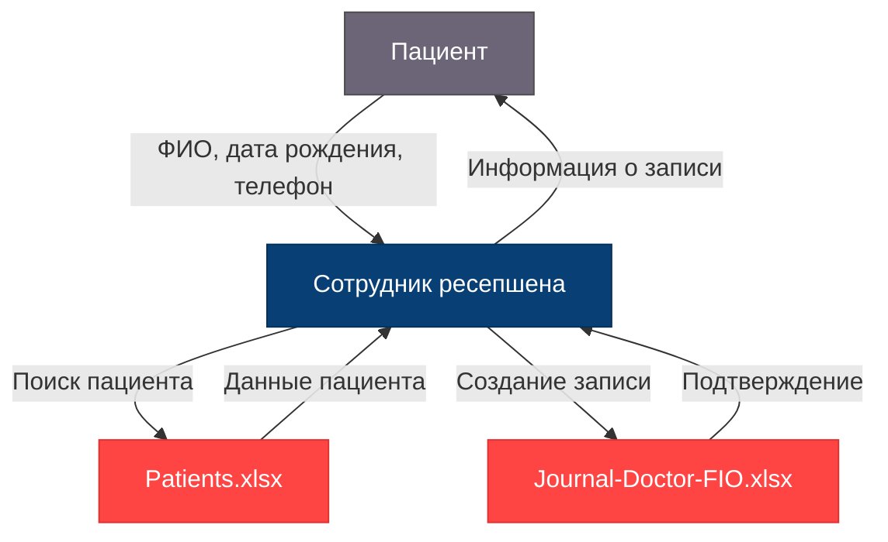

**Проблемы безопасности:**
-  Нет шифрования данных
-  Нет контроля доступа
-  Нет аудита операций
-  ФИО в открытом виде

### Конфиденциальные данные в потоке
- **ФИО пациента** (PII, уровень 2)
- **Дата рождения** (PII, уровень 2)
- **Телефон** (PII, уровень 2)
- **Email** (PII, уровень 2)
- **Адрес прописки** (PII, уровень 2)
- **Информация о записи к врачу** (медицинская тайна, уровень 1)

### Проблемы безопасности
1.  Данные передаются устно без шифрования
2.  Excel-файлы не защищены паролем
3.  Нет аудита доступа к файлам
4.  Все сотрудники ресепшена имеют доступ ко всем журналам
5.  Данные хранятся на общем диске без разграничения доступа

---

## Процесс 2: Регистрация нового пациента

### Описание процесса
При первом обращении пациента сотрудник ресепшена создаёт карточку пациента в системе.

### Диаграмма Mermaid

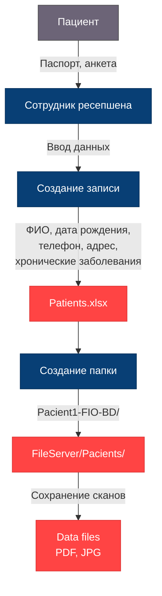

**Проблемы безопасности:**
-  Нет согласия на обработку ПДн
-  Данные в открытом виде
-  ФИО и дата рождения в имени папки
-  Нет шифрования файлов
-  Все сотрудники имеют доступ

### Конфиденциальные данные в потоке
- **Паспортные данные** (PII, уровень 2)
- **ФИО, дата рождения** (PII, уровень 2)
- **Контактные данные** (телефон, email, адрес) (PII, уровень 2)
- **Место работы/учёбы** (PII, уровень 2)
- **Хронические заболевания** (медицинская тайна, уровень 1)
- **Скан паспорта** (PII, уровень 2)

### Проблемы безопасности
1.  Отсутствует согласие на обработку ПДн
2.  Данные хранятся в открытом виде (незашифрованные PDF/JPG)
3.  Имя папки содержит ФИО и дату рождения (раскрытие PII)
4.  Нет контроля целостности данных
5.  Отсутствует версионирование изменений
6.  Все сотрудники имеют доступ к папкам всех пациентов

---

## Процесс 3: Приём пациента врачом

### Описание процесса
Врач принимает пациента, изучает его медицинскую карту, проводит осмотр и вносит записи в карту.

### Диаграмма Mermaid

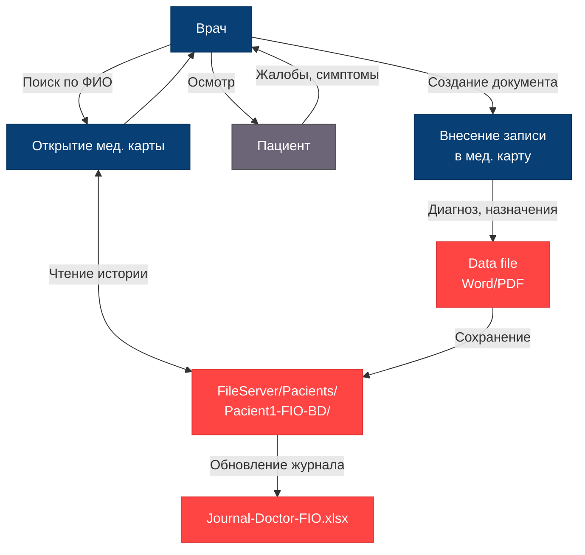

**Проблемы безопасности:**
-  Врач имеет доступ к картам всех пациентов
-  Нет аудита просмотра карт
-  Нет контроля изменений
-  Данные не шифруются
-  Возможность копирования на внешние носители
-  Нет электронной подписи врача

### Конфиденциальные данные в потоке
- **Медицинская карта** (медицинская тайна, уровень 1)
- **История болезни** (медицинская тайна, уровень 1)
- **Жалобы и симптомы** (медицинская тайна, уровень 1)
- **Диагноз** (медицинская тайна, уровень 1)
- **Назначения и рекомендации** (медицинская тайна, уровень 1)

### Проблемы безопасности
1.  Врач имеет доступ к картам всех пациентов, а не только своих
2.  Нет аудита просмотра медицинских карт
3.  Отсутствует контроль изменений (кто, когда, что изменил)
4.  Данные не шифруются
5.  Возможность копирования файлов на внешние носители
6.  Отсутствует электронная подпись врача

---

## Процесс 4: Интеграция с лабораторией (отправка пациента на анализы)

### Описание процесса
Врач направляет пациента на анализы в лабораторию. Результаты анализов возвращаются и сохраняются в карте пациента.

### Диаграмма Mermaid

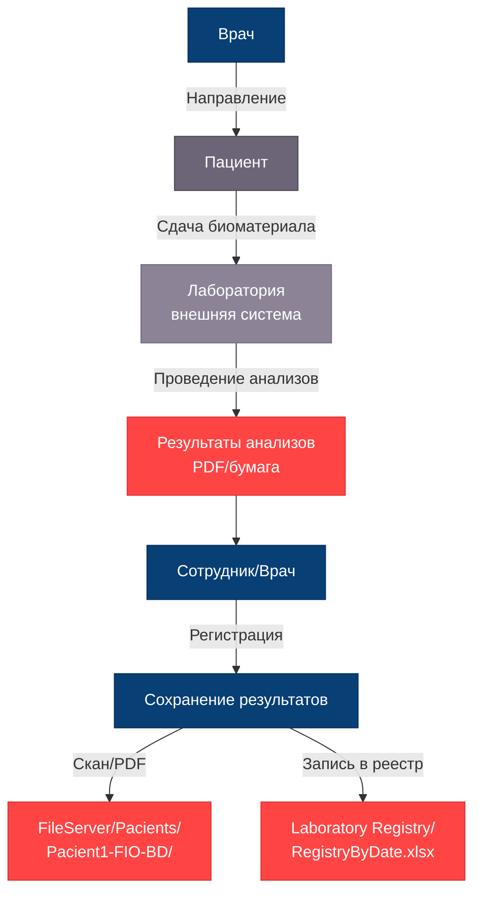

**Проблемы безопасности:**
-  Нет защищённого канала с лабораторией
-  Результаты могут передаваться по email без шифрования
-  Бумажные результаты могут быть утеряны
-  Нет контроля целостности результатов
-  Реестр содержит ФИО в открытом виде
-  Нет API для безопасной интеграции

### Конфиденциальные данные в потоке
- **Направление на анализы** (медицинская тайна, уровень 1)
- **Результаты анализов** (медицинская тайна, уровень 1)
- **ФИО пациента в реестре** (PII + медицинская тайна, уровень 1)
- **Биометрические данные** (результаты анализов крови, мочи и т.д., уровень 1)

### Проблемы безопасности
1.  Нет защищённого канала передачи данных с лабораторией
2.  Результаты могут передаваться по email без шифрования
3.  Бумажные результаты могут быть утеряны
4.  Нет контроля целостности результатов (возможность подделки)
5.  Реестр анализов содержит ФИО в открытом виде
6.  Отсутствует API для безопасной интеграции с лабораторией

---

## Процесс 5: Оплата медицинских услуг

### Описание процесса
Пациент оплачивает медицинские услуги через кассу. Информация о платеже регистрируется в ККМ и 1С.

### Диаграмма Mermaid

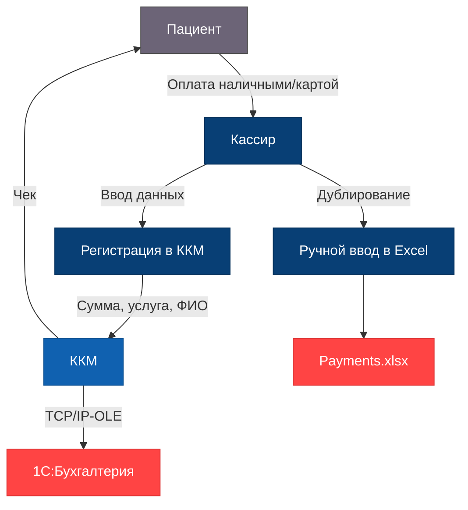

**Проблемы безопасности:**
-  Двойной учёт (ККМ + Excel) увеличивает риск утечки
-  Excel с платежами доступен всем
-  Связь платежа с услугой раскрывает медицинскую тайну
-  Нет шифрования данных о платежах
-  Нет аудита доступа к финансовым данным
-  Чеки содержат ФИО и информацию об услуге

### Конфиденциальные данные в потоке
- **ФИО пациента** (PII, уровень 2)
- **Сумма платежа** (финансовые данные, уровень 2)
- **Услуга** (косвенно раскрывает медицинскую информацию, уровень 1)
- **Дата платежа** (PII, уровень 2)
- **Фискальные данные** (финансовые данные, уровень 2)

### Проблемы безопасности
1.  Двойной учёт (ККМ + Excel) увеличивает риск утечки
2.  Excel-файл с платежами доступен всем
3.  Связь платежа с медицинской услугой раскрывает медицинскую тайну
4.  Нет шифрования данных о платежах
5.  Отсутствует аудит доступа к финансовым данным
6.  Чеки содержат ФИО и информацию об услуге

---

## Процесс 6: Бухгалтерский учёт и процессинг платежей

### Описание процесса
Бухгалтер обрабатывает платежи, ведёт учёт доходов, начисляет зарплату и готовит отчётность.

### Диаграмма Mermaid

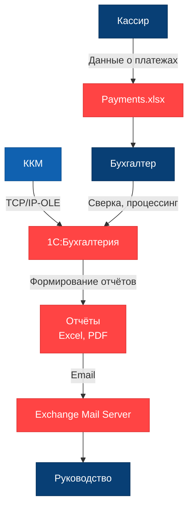

**Проблемы безопасности:**
-  1С в файловом режиме (низкая безопасность)
-  Нет разграничения доступа внутри 1С
-  Отчёты отправляются по email без шифрования
-  Нет аудита действий в 1С
-  Возможность копирования базы 1С
-  Нет резервного копирования с контролем доступа

### Конфиденциальные данные в потоке
- **Финансовые данные компании** (коммерческая тайна, уровень 2)
- **Данные о зарплатах** (PII сотрудников, уровень 2)
- **Налоговая отчётность** (финансовые данные, уровень 2)
- **Данные о доходах от медицинских услуг** (коммерческая тайна, уровень 2)

### Проблемы безопасности
1.  1С работает в файловом режиме (низкая безопасность)
2.  Отсутствует разграничение доступа внутри 1С
3.  Отчёты отправляются по email без шифрования
4.  Нет аудита действий в 1С
5.  Возможность копирования базы 1С
6.  Отсутствует резервное копирование с контролем доступа

---

## Процесс 7: Учёт товарно-материальных ценностей

### Описание процесса
Сотрудник склада ведёт учёт ТМЦ, медицинского оборудования и расходных материалов.

### Диаграмма Mermaid

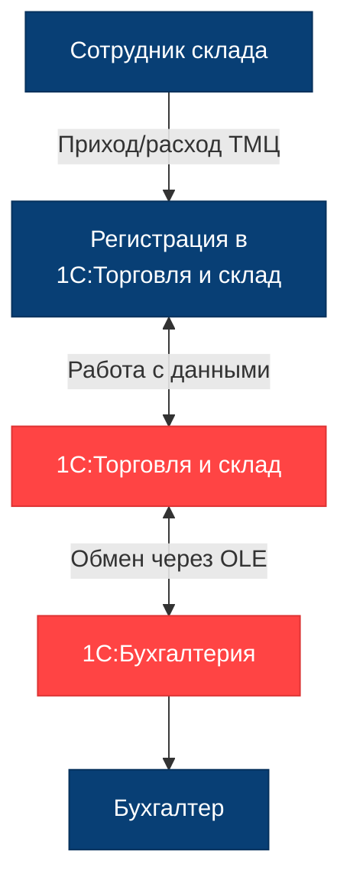

**Проблемы безопасности:**
-  Файловый режим работы 1С
-  Нет аудита операций
-  Нет разграничения доступа к данным о ТМЦ
-  Возможность несанкционированного изменения данных

### Конфиденциальные данные в потоке
- **Данные о ТМЦ** (коммерческая тайна, уровень 3)
- **Информация о поставщиках** (коммерческая тайна, уровень 3)
- **Стоимость закупок** (финансовые данные, уровень 2)

### Проблемы безопасности
1.  Файловый режим работы 1С
2.  Отсутствие аудита операций
3.  Нет разграничения доступа к данным о ТМЦ
4.  Возможность несанкционированного изменения данных

---

## Процесс 8: Внутренняя коммуникация

### Описание процесса
Сотрудники обмениваются информацией через Exchange Mail Server.

### Диаграмма Mermaid

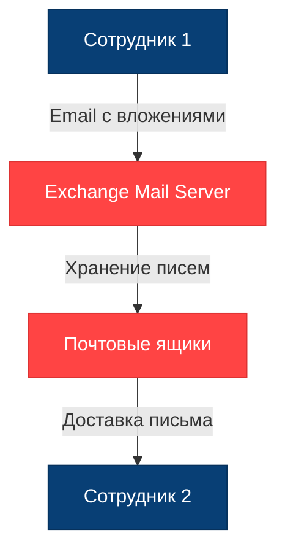

**Проблемы безопасности:**
-  Нет шифрования писем
-  Нет классификации по уровню конфиденциальности
-  Возможность пересылки на внешние адреса
-  Нет DLP (Data Loss Prevention)
-  Нет контроля вложений
-  Письма хранятся неограниченное время

### Конфиденциальные данные в потоке
- **Медицинская информация в письмах** (медицинская тайна, уровень 1)
- **Финансовые данные в отчётах** (коммерческая тайна, уровень 2)
- **Персональные данные в переписке** (PII, уровень 2)
- **Вложения с конфиденциальными файлами** (различные уровни)

### Проблемы безопасности
1.  Отсутствует шифрование писем
2.  Нет классификации писем по уровню конфиденциальности
3.  Возможность пересылки конфиденциальных данных на внешние адреса
4.  Отсутствует DLP (Data Loss Prevention)
5.  Нет контроля вложений
6.  Письма хранятся неограниченное время

---

## Сводная таблица потоков конфиденциальных данных

| Процесс | Источник | Приёмник | Тип данных | Уровень | Защита |
|---------|----------|----------|------------|---------|--------|
| Запись на приём | Пациент | Журнал врача | PII + мед. тайна | 1-2 |  Нет |
| Регистрация пациента | Пациент | Patients.xlsx | PII | 2 |  Нет |
| Приём врача | Пациент | Мед. карта | Мед. тайна | 1 |  Нет |
| Анализы | Лаборатория | Мед. карта | Мед. тайна | 1 |  Нет |
| Оплата | Пациент | ККМ/1С | Финансы + PII | 1-2 |  Нет |
| Бухгалтерия | ККМ | 1С | Финансы | 2 |  Нет |
| Склад | Поставщик | 1С | Коммерч. тайна | 3 |  Нет |
| Почта | Сотрудник | Сотрудник | Различные | 1-3 |  Нет |

## Выводы

**Критические проблемы:**
1. Все потоки данных не защищены
2. Отсутствует шифрование данных при хранении и передаче
3. Нет аудита доступа к конфиденциальным данным
4. Отсутствует разграничение доступа
5. Данные доступны всем сотрудникам
6. Нет классификации и тегирования данных
7. Отсутствуют механизмы обнаружения утечек (DLP)
8. Нет контроля целостности данных

---

# 3. Аудит мер по обеспечению безопасности данных

## 3.1 Сопоставление с требованиями законодательства РФ

### 3.1.1 Федеральный закон № 152-ФЗ "О персональных данных"

| Требование | Текущее состояние | Соответствие | Риск |
|------------|-------------------|--------------|------|
| Получение согласия на обработку ПДн |  Отсутствует система учёта согласий | **НЕ СООТВЕТСТВУЕТ** |  Критический |
| Уведомление Роскомнадзора |  Нет данных об уведомлении | **НЕ СООТВЕТСТВУЕТ** |  Критический |
| Назначение ответственного за ПДн |  Не назначен | **НЕ СООТВЕТСТВУЕТ** |  Критический |
| Обеспечение безопасности ПДн |  Нет мер защиты | **НЕ СООТВЕТСТВУЕТ** |  Критический |
| Право субъекта на доступ к данным |  Нет процедуры предоставления | **НЕ СООТВЕТСТВУЕТ** |  Высокий |
| Право на удаление данных |  Нет механизма удаления | **НЕ СООТВЕТСТВУЕТ** |  Критический |
| Ограничение срока хранения |  Данные хранятся бессрочно | **НЕ СООТВЕТСТВУЕТ** |  Высокий |
| Обезличивание данных |  Не применяется | **НЕ СООТВЕТСТВУЕТ** |  Высокий |

**Вывод:** Полное несоответствие требованиям ФЗ-152. Риск штрафов до 500 000 руб.

---

### 3.1.2 Федеральный закон № 323-ФЗ "Об основах охраны здоровья"

| Требование | Текущее состояние | Соответствие | Риск |
|------------|-------------------|--------------|------|
| Соблюдение медицинской тайны |  Данные доступны всем сотрудникам | **НЕ СООТВЕТСТВУЕТ** |  Критический |
| Запрет на разглашение |  Нет контроля разглашения | **НЕ СООТВЕТСТВУЕТ** |  Критический |
| Защита медицинской документации |  Файлы не защищены | **НЕ СООТВЕТСТВУЕТ** |  Критический |
| Хранение медицинских документов |  Хранятся, но без защиты | **ЧАСТИЧНО** |  Высокий |
| Электронная подпись врача |  Не используется | **НЕ СООТВЕТСТВУЕТ** |  Высокий |

**Вывод:** Критическое нарушение медицинской тайны. Риск уголовной ответственности (ст. 137 УК РФ).

---

### 3.1.3 Приказ ФСТЭК России № 21

| Мера защиты | Текущее состояние | Соответствие | Риск |
|-------------|-------------------|--------------|------|
| Идентификация и аутентификация |  Только доменная аутентификация | **ЧАСТИЧНО** |  Высокий |
| Управление доступом (RBAC/ABAC) |  Отсутствует | **НЕ СООТВЕТСТВУЕТ** |  Критический |
| Ограничение программной среды |  Не реализовано | **НЕ СООТВЕТСТВУЕТ** |  Высокий |
| Защита машинных носителей |  Нет шифрования дисков | **НЕ СООТВЕТСТВУЕТ** |  Критический |
| Регистрация событий безопасности |  Отсутствует аудит | **НЕ СООТВЕТСТВУЕТ** |  Критический |
| Антивирусная защита |  Вероятно есть, но не указано | **НЕИЗВЕСТНО** |  Высокий |
| Обнаружение вторжений (IDS/IPS) |  Отсутствует | **НЕ СООТВЕТСТВУЕТ** |  Высокий |
| Контроль защищённости |  Не проводится | **НЕ СООТВЕТСТВУЕТ** |  Высокий |
| Резервное копирование |  Не указано | **НЕИЗВЕСТНО** |  Критический |
| Шифрование данных |  Отсутствует | **НЕ СООТВЕТСТВУЕТ** |  Критический |

**Вывод:** Система не соответствует требованиям ФСТЭК. Необходима полная переработка мер защиты.

---

## 3.2 Сопоставление с архитектурными практиками безопасности

### 3.2.1 Privacy by Design (Конфиденциальность по дизайну)

| Принцип | Текущее состояние | Оценка |
|---------|-------------------|--------|
| **1. Проактивность, а не реактивность** |  Нет превентивных мер защиты | **0/10** |
| **2. Конфиденциальность по умолчанию** |  Все данные открыты по умолчанию | **0/10** |
| **3. Встроенная конфиденциальность** |  Безопасность не заложена в архитектуру | **0/10** |
| **4. Полная функциональность** |  Система работает, но небезопасно | **3/10** |
| **5. Сквозная безопасность** |  Нет защиты на всех этапах жизненного цикла | **0/10** |
| **6. Видимость и прозрачность** |  Нет аудита и мониторинга | **0/10** |
| **7. Уважение к конфиденциальности** |  Нет механизмов защиты прав субъектов | **0/10** |

**Общая оценка:** 3/70 (4%) - **Критически низкий уровень**

---

### 3.2.2 Data Minimization (Минимизация данных)

| Аспект | Текущее состояние | Оценка |
|--------|-------------------|--------|
| Сбор только необходимых данных |  Собираются избыточные данные (место работы, адрес для всех) | **3/10** |
| Ограничение доступа |  Все сотрудники имеют доступ ко всем данным | **0/10** |
| Ограничение срока хранения |  Данные хранятся бессрочно | **0/10** |
| Обезличивание |  Не применяется | **0/10** |
| Псевдонимизация |  Не применяется | **0/10** |

**Общая оценка:** 3/50 (6%) - **Критически низкий уровень**

---

### 3.2.3 Data Lineage (Отслеживание происхождения данных)

| Аспект | Текущее состояние | Оценка |
|--------|-------------------|--------|
| Отслеживание источника данных |  Нет метаданных об источнике | **0/10** |
| История изменений |  Нет версионирования | **0/10** |
| Аудит доступа |  Не ведётся журнал доступа | **0/10** |
| Цепочка обработки |  Не отслеживается путь данных | **0/10** |
| Контроль качества данных |  Нет валидации и проверки целостности | **0/10** |

**Общая оценка:** 0/50 (0%) - **Отсутствует полностью**

---

### 3.2.4 Zero Trust Architecture (Архитектура нулевого доверия)

| Принцип | Текущее состояние | Оценка |
|---------|-------------------|--------|
| Никогда не доверяй, всегда проверяй |  Доверие по умолчанию внутри сети | **0/10** |
| Минимальные привилегии |  Все имеют полный доступ | **0/10** |
| Микросегментация |  Общий файловый сервер | **0/10** |
| Многофакторная аутентификация |  Только пароль домена | **2/10** |
| Непрерывная верификация |  Аутентификация только при входе | **1/10** |

**Общая оценка:** 3/50 (6%) - **Критически низкий уровень**

---

### 3.2.5 Defense in Depth (Эшелонированная защита)

| Уровень защиты | Текущее состояние | Оценка |
|----------------|-------------------|--------|
| **Физический уровень** |  Сервер в офисе (есть физическая защита здания) | **5/10** |
| **Сетевой уровень** |  Нет сегментации сети, файрволов | **2/10** |
| **Уровень хоста** |  Windows Server с базовыми настройками | **3/10** |
| **Уровень приложений** |  Excel, 1С без дополнительной защиты | **1/10** |
| **Уровень данных** |  Нет шифрования, контроля доступа | **0/10** |
| **Уровень пользователей** |  Доменная аутентификация | **3/10** |

**Общая оценка:** 14/60 (23%) - **Очень низкий уровень**

---

## 3.3 Сводная таблица проблемных зон

| № | Проблема | Приоритет | Затронутые процессы | Нарушаемые требования |
|---|----------|-----------|---------------------|----------------------|
| 1 | Отсутствие контроля доступа |  Критический | Все | ФЗ-152, ФЗ-323, ФСТЭК |
| 2 | Отсутствие шифрования |  Критический | Все | ФСТЭК, ФЗ-152 |
| 3 | Отсутствие аудита |  Критический | Все | ФСТЭК |
| 4 | Отсутствие согласий на ПДн |  Критический | Регистрация, приём | ФЗ-152 |
| 5 | Нет механизма удаления данных |  Критический | Все | ФЗ-152 |
| 6 | PII в именах папок |  Высокий | Хранение данных | Privacy by Design |
| 7 | Незащищённая интеграция с лабораторией |  Высокий | Анализы | ФЗ-323 |
| 8 | Двойной учёт платежей |  Высокий | Оплата | Data Minimization |
| 9 | Нет классификации данных |  Высокий | Все | Privacy by Design |
| 10 | Файловый режим 1С |  Высокий | Бухгалтерия, склад | ФСТЭК |
| 11 | Нет версионирования |  Средний | Медицинские карты | Data Lineage |
| 12 | Нет электронной подписи |  Средний | Медицинские документы | ФЗ-323 |
| 13 | Отсутствие DLP |  Средний | Все | ФСТЭК |
| 14 | Нет защиты бэкапов |  Средний | Все | ФСТЭК |
| 15 | Нет обучения сотрудников |  Средний | Все | ФЗ-152 |

---

## 3.4 Общая оценка уровня безопасности

### Матрица соответствия

| Область | Оценка | Статус |
|---------|--------|--------|
| Законодательство РФ | 5% |  Критический |
| Privacy by Design | 4% |  Критический |
| Data Minimization | 6% |  Критический |
| Data Lineage | 0% |  Критический |
| Zero Trust | 6% |  Критический |
| Defense in Depth | 23% |  Критический |

### Общий уровень безопасности: **7%** - КРИТИЧЕСКИ НИЗКИЙ

---

## 3.5 Выводы

Текущее состояние системы безопасности компании «Медикаменте» является **критически неудовлетворительным** и создаёт **серьёзные юридические, финансовые и репутационные риски**.

**Ключевые выводы:**
1.  Система не соответствует требованиям российского законодательства
2.  Отсутствуют базовые меры защиты конфиденциальных данных
3.  Высокий риск утечки медицинских данных пациентов
4.  Необходима срочная реализация мер по защите данных
5.  Требуется полная переработка архитектуры безопасности

**Критические риски:**
- Штрафы до 500 000 руб. за нарушение ФЗ-152
- Уголовная ответственность за разглашение медицинской тайны
- Приостановка деятельности по предписанию Роскомнадзора
- Массовая утечка данных пациентов
- Потеря репутации и доверия клиентов

---

# 4. Рекомендации по улучшению защиты данных

## 4.1 Список данных для защиты и способы защиты

### 4.1.1 Критический уровень (Уровень 1)

| Тип данных | Примеры | Способ защиты | Обоснование |
|------------|---------|---------------|-------------|
| **Медицинские карты** | История болезни, диагнозы, назначения | **Шифрование** + **Обезличивание** | Медицинская тайна, требования ФЗ-323 |
| **Результаты анализов** | Анализы крови, мочи, биохимия | **Шифрование** + **Обезличивание** | Биометрические данные, особая категория ПДн |
| **Диагнозы** | Заключения врачей, диагностические данные | **Шифрование** + **Обезличивание** | Медицинская тайна |
| **Информация о хронических заболеваниях** | Диабет, гипертония и т.д. | **Шифрование** + **Обезличивание** | Особая категория ПДн (ФЗ-152, ст. 10) |
| **Связь платежа с медицинской услугой** | Оплата за конкретную процедуру | **Обезличивание** + **Обфускация** | Раскрывает медицинскую информацию |

### 4.1.2 Высокий уровень (Уровень 2)

| Тип данных | Примеры | Способ защиты | Обоснование |
|------------|---------|---------------|-------------|
| **ФИО пациента** | Иванов Иван Иванович | **Обезличивание** (замена на ID) | PII, требования ФЗ-152 |
| **Дата рождения** | 01.01.1980 | **Обфускация** (год рождения) или **Обезличивание** | PII, возможность идентификации |
| **Телефон** | +7 (999) 123-45-67 | **Обфускация** (+7 (999) ***-**-67) | PII, контактные данные |
| **Email** | patient@example.com | **Обфускация** (p******@example.com) | PII, контактные данные |
| **Адрес прописки** | г. Москва, ул. Ленина, д. 1 | **Обфускация** (только город) или **Обезличивание** | PII, требования ФЗ-152 |
| **Паспортные данные** | Серия, номер паспорта | **Шифрование** + **Обезличивание** | PII, документы удостоверяющие личность |
| **Согласия на обработку ПДн** | Скан подписанного согласия | **Шифрование** | Юридически значимый документ |
| **Данные о зарплатах сотрудников** | Оклады, премии | **Шифрование** + **Обезличивание** | PII сотрудников, коммерческая тайна |
| **Финансовые данные компании** | Выручка, прибыль | **Шифрование** | Коммерческая тайна |

### 4.1.3 Средний уровень (Уровень 3)

| Тип данных | Примеры | Способ защиты | Обоснование |
|------------|---------|---------------|-------------|
| **Журналы записи к специалистам** | Расписание приёмов | **Обезличивание** (ID вместо ФИО) | Косвенно раскрывает медицинскую информацию |
| **Реестры анализов** | Список анализов за день | **Обезличивание** | Агрегированные данные |
| **Данные ТМЦ** | Остатки на складе, закупки | **Шифрование** | Коммерческая тайна |
| **Внутренняя переписка** | Email между сотрудниками | **Шифрование** (TLS) | Может содержать конфиденциальную информацию |
| **Место работы/учёбы пациента** | ООО "Компания" | **Обезличивание** (удалить, если не критично) | PII, избыточные данные |

### 4.1.4 Низкий уровень (Уровень 4)

| Тип данных | Примеры | Способ защиты | Обоснование |
|------------|---------|---------------|-------------|
| **Расписание работы врачей** | График работы (без пациентов) | Базовый контроль доступа | Служебная информация |
| **Справочная информация** | Прайс-лист услуг | Нет специальной защиты | Публичная информация |

---

## 4.2 Детальное описание способов защиты

### 4.2.1 Шифрование (Encryption)

**Определение:** Преобразование данных в нечитаемый вид с помощью криптографических алгоритмов.

#### Шифрование при хранении (Encryption at Rest)

**Рекомендуемые технологии:**
- **BitLocker** (для Windows Server) - шифрование дисков
- **AES-256** - стандарт шифрования для файлов
- **Transparent Data Encryption (TDE)** - для баз данных
- **Шифрование на уровне приложения** - для особо критичных данных

**Применение:**
```
Медицинские карты (PDF, Word) → Шифрование AES-256 → Хранение на диске
Результаты анализов (PDF, JPG) → Шифрование AES-256 → Хранение на диске
База данных 1С → TDE → Защищённое хранение
```

**Преимущества:**
-  Защита при краже физических носителей
-  Соответствие требованиям ФСТЭК
-  Защита от несанкционированного доступа

**Недостатки:**
-  Снижение производительности (5-10%)
-  Необходимость управления ключами

#### Шифрование при передаче (Encryption in Transit)

**Рекомендуемые технологии:**
- **TLS 1.3** - для веб-трафика и API
- **VPN (IPSec)** - для интеграций с внешними системами
- **S/MIME** - для шифрования email

**Применение:**
```
Портал пациента → HTTPS (TLS 1.3) → Сервер
Интеграция с лабораторией → VPN → Защищённый канал
Email с результатами → S/MIME → Зашифрованное письмо
```

---

### 4.2.2 Обезличивание (Anonymization)

**Определение:** Необратимое удаление или изменение данных, позволяющих идентифицировать субъекта.

#### Методы обезличивания

**1. Замена на псевдоним (Pseudonymization)**
```
ФИО: "Иванов Иван Иванович" → Patient_ID: "PAT-2024-00001"
Дата рождения: "01.01.1980" → Возрастная группа: "40-45 лет"
Адрес: "г. Москва, ул. Ленина, д. 1" → Регион: "Москва"
```

**2. Удаление прямых идентификаторов**
```
Медицинская карта:
БЫЛО: "Пациент Иванов И.И., 01.01.1980, диагноз: диабет"
СТАЛО: "Пациент PAT-00001, возраст 44 года, диагноз: диабет"
```

**3. Агрегирование данных**
```
Реестр анализов:
БЫЛО: [Иванов - анализ крови, Петров - анализ мочи]
СТАЛО: [Количество анализов за день: 2, типы: кровь-1, моча-1]
```

**Применение:**
- Медицинские карты для исследований
- Статистические отчёты
- Данные для обучения ML-моделей
- Реестры и журналы

**Преимущества:**
-  Данные перестают быть персональными (не применяется ФЗ-152)
-  Можно использовать для аналитики
-  Снижение рисков утечки

**Недостатки:**
-  Необратимость (нельзя восстановить исходные данные)
-  Риск реидентификации при комбинации данных

---

### 4.2.3 Обфускация (Obfuscation)

**Определение:** Частичное скрытие данных с сохранением возможности идентификации при необходимости.

#### Методы обфускации

**1. Маскирование (Masking)**
```
Телефон: +7 (999) 123-45-67 → +7 (999) ***-**-67
Email: patient@example.com → p******@example.com
Паспорт: 1234 567890 → **** ***890
```

**2. Токенизация (Tokenization)**
```
ФИО: "Иванов Иван Иванович" → Token: "TKN_8F3A9B2C"
(с возможностью обратного преобразования через защищённый сервис)
```

**3. Хеширование с солью**
```
Email: patient@example.com → Hash: "a3f5b8c9d2e1..."
(для проверки уникальности без раскрытия)
```

**Применение:**
- Отображение данных в интерфейсах
- Логи и журналы аудита
- Тестовые среды
- Отчёты для руководства

**Преимущества:**
-  Обратимость (можно восстановить при необходимости)
-  Снижение рисков при утечке логов
-  Соответствие принципу минимизации данных

**Недостатки:**
-  Данные остаются персональными (применяется ФЗ-152)
-  Необходимость защиты механизма деобфускации

---

## 4.3 Матрица применения способов защиты

| Сценарий использования | Шифрование | Обезличивание | Обфускация |
|------------------------|------------|---------------|------------|
| **Хранение медицинских карт** |  Обязательно |  Нет |  Нет |
| **Передача данных в лабораторию** |  Обязательно |  Опционально |  Нет |
| **Отображение в интерфейсе врача** |  Расшифровка |  Нет |  Опционально |
| **Статистические отчёты** |  Нет |  Обязательно |  Нет |
| **Обучение ML-моделей** |  Нет |  Обязательно |  Нет |
| **Логи доступа** |  Опционально |  Нет |  Обязательно |
| **Тестовая среда** |  Опционально |  Рекомендуется |  Обязательно |
| **Резервные копии** |  Обязательно |  Нет |  Нет |
| **Email-уведомления** |  Обязательно (TLS) |  Нет |  Обязательно |
| **Мобильное приложение пациента** |  Обязательно |  Нет |  Опционально |

---

## 4.4 Рекомендации по инструментам и мерам защиты

### 4.4.1 Инструменты шифрования

#### Для Windows Server
```
1. BitLocker Drive Encryption
   - Шифрование системного диска
   - Шифрование диска с данными
   - Управление ключами через TPM

2. EFS (Encrypting File System)
   - Шифрование отдельных папок
   - Интеграция с Active Directory
   - Управление сертификатами
```

#### Для баз данных
```
1. SQL Server TDE (Transparent Data Encryption)
   - Шифрование файлов базы данных
   - Прозрачно для приложений

2. PostgreSQL pgcrypto
   - Шифрование на уровне столбцов
   - Гибкое управление ключами
```

#### Для файлов
```
1. VeraCrypt
   - Создание зашифрованных контейнеров
   - Открытый исходный код

2. 7-Zip с AES-256
   - Шифрование архивов
   - Простота использования
```

---

### 4.4.2 Инструменты контроля доступа

#### Identity and Access Management (IAM)

**Active Directory + RBAC (Role-Based Access Control)**
```
Роли:
├── Администратор системы (полный доступ)
├── Врач (доступ к картам своих пациентов)
├── Медсестра (ограниченный доступ к картам)
├── Ресепшен (доступ к журналам и регистрации)
├── Бухгалтер (доступ к финансовым данным)
├── Кассир (доступ к ККМ и платежам)
└── Складской работник (доступ к ТМЦ)
```

**ABAC (Attribute-Based Access Control)**
```
Правила доступа:
- Врач может читать карты пациентов, к которым записан
- Врач может писать в карты только во время приёма
- Бухгалтер может читать финансовые данные только в рабочее время
- Доступ к особо конфиденциальным данным требует MFA
```

---

### 4.4.3 Инструменты аудита и мониторинга

#### Журналирование событий безопасности

**Windows Event Log + SIEM**
```
Регистрируемые события:
- Вход/выход пользователей
- Доступ к файлам с медицинскими данными
- Изменение прав доступа
- Попытки несанкционированного доступа
- Копирование файлов
- Печать документов
```

**Рекомендуемые SIEM-системы:**
- **Wazuh** (открытый исходный код)
- **Elastic Stack (ELK)** - для анализа логов
- **Graylog** - централизованное логирование

---

### 4.4.4 Инструменты предотвращения утечек (DLP)

**Data Loss Prevention системы:**

**1. Контроль передачи данных**
```
- Блокировка отправки файлов с тегом "Конфиденциально" на внешние email
- Запрет копирования на USB-носители
- Контроль печати документов
- Мониторинг передачи данных по сети
```

**2. Обнаружение конфиденциальных данных**
```
- Сканирование файлов на наличие ПДн (ФИО, паспорта)
- Обнаружение медицинских терминов
- Поиск номеров телефонов, email
- Классификация документов
```

**Рекомендуемые решения:**
- **Microsoft Purview** (для экосистемы Microsoft)
- **Symantec DLP**
- **Digital Guardian**
- **OpenDLP** (открытый исходный код)

---

### 4.4.5 Инструменты тегирования данных

#### Система классификации и маркировки

**Microsoft Information Protection (MIP)**
```
Метки конфиденциальности:
├── Публичная (Public)
├── Внутренняя (Internal)
├── Конфиденциальная (Confidential)
│   ├── Персональные данные
│   ├── Финансовые данные
│   └── Коммерческая тайна
└── Строго конфиденциальная (Highly Confidential)
    ├── Медицинская тайна
    └── Особые категории ПДн
```

**Автоматическое тегирование:**
```
Правила:
- Файл содержит слова "диагноз", "анализ" → Метка: "Медицинская тайна"
- Файл содержит ФИО + дату рождения → Метка: "Персональные данные"
- Файл в папке "Пациенты" → Метка: "Конфиденциальная"
- Email с вложением .pdf из папки пациентов → Предупреждение
```

---

# 5. Механизм тегирования данных

## 5.1 Концепция тегирования

### 5.1.1 Определение

**Тегирование данных** — это процесс присвоения метаданных (тегов, меток) конфиденциальным данным для их автоматической классификации, контроля доступа и применения соответствующих мер защиты.

### 5.1.2 Цели тегирования

1. **Автоматическая классификация** - определение уровня конфиденциальности данных
2. **Контроль доступа** - применение политик безопасности на основе тегов
3. **Предотвращение утечек** - блокировка передачи данных с критичными тегами
4. **Аудит и мониторинг** - отслеживание операций с конфиденциальными данными
5. **Соответствие требованиям** - автоматическая проверка соблюдения политик

---

## 5.2 Таксономия тегов

### 5.2.1 Иерархия тегов

```
Конфиденциальные данные
│
├── Уровень конфиденциальности
│   ├── PUBLIC (Публичные)
│   ├── INTERNAL (Внутренние)
│   ├── CONFIDENTIAL (Конфиденциальные)
│   └── HIGHLY_CONFIDENTIAL (Строго конфиденциальные)
│
├── Тип данных
│   ├── PII (Персональные данные)
│   │   ├── PII_NAME (ФИО)
│   │   ├── PII_BIRTHDATE (Дата рождения)
│   │   ├── PII_PHONE (Телефон)
│   │   ├── PII_EMAIL (Email)
│   │   ├── PII_ADDRESS (Адрес)
│   │   └── PII_PASSPORT (Паспортные данные)
│   │
│   ├── MEDICAL (Медицинские данные)
│   │   ├── MEDICAL_RECORD (Медицинская карта)
│   │   ├── MEDICAL_DIAGNOSIS (Диагноз)
│   │   ├── MEDICAL_TEST_RESULT (Результаты анализов)
│   │   ├── MEDICAL_PRESCRIPTION (Назначения)
│   │   └── MEDICAL_CHRONIC_DISEASE (Хронические заболевания)
│   │
│   ├── FINANCIAL (Финансовые данные)
│   │   ├── FINANCIAL_PAYMENT (Платёж)
│   │   ├── FINANCIAL_SALARY (Зарплата)
│   │   ├── FINANCIAL_REVENUE (Выручка)
│   │   └── FINANCIAL_TAX (Налоговые данные)
│   │
│   └── COMMERCIAL (Коммерческая тайна)
│       ├── COMMERCIAL_INVENTORY (ТМЦ)
│       ├── COMMERCIAL_SUPPLIER (Поставщики)
│       └── COMMERCIAL_PRICING (Ценообразование)
│
├── Требуемая защита
│   ├── ENCRYPTION_REQUIRED (Требуется шифрование)
│   ├── ANONYMIZATION_REQUIRED (Требуется обезличивание)
│   ├── OBFUSCATION_REQUIRED (Требуется обфускация)
│   └── ACCESS_CONTROL_REQUIRED (Требуется контроль доступа)
│
├── Правовая основа
│   ├── FZ152 (ФЗ-152 "О персональных данных")
│   ├── FZ323 (ФЗ-323 "Об охране здоровья")
│   ├── FSTEK (Требования ФСТЭК)
│   └── MEDICAL_SECRET (Медицинская тайна)
│
└── Срок хранения
    ├── RETENTION_1Y (1 год)
    ├── RETENTION_3Y (3 года)
    ├── RETENTION_5Y (5 лет)
    ├── RETENTION_10Y (10 лет)
    └── RETENTION_PERMANENT (Постоянно)
```

---

## 5.3 Схема тегирования для компании «Медикаменте»

### 5.3.1 Матрица тегов для типов данных

| Тип данных | Уровень | Теги | Защита | Правовая основа | Срок хранения |
|------------|---------|------|--------|-----------------|---------------|
| **Медицинская карта** | HIGHLY_CONFIDENTIAL | MEDICAL_RECORD, PII_NAME | ENCRYPTION_REQUIRED | FZ323, MEDICAL_SECRET | RETENTION_10Y |
| **Результаты анализов** | HIGHLY_CONFIDENTIAL | MEDICAL_TEST_RESULT, PII_NAME | ENCRYPTION_REQUIRED, ANONYMIZATION_REQUIRED | FZ323, MEDICAL_SECRET | RETENTION_5Y |
| **Диагноз** | HIGHLY_CONFIDENTIAL | MEDICAL_DIAGNOSIS | ENCRYPTION_REQUIRED | FZ323, MEDICAL_SECRET | RETENTION_10Y |
| **ФИО пациента** | CONFIDENTIAL | PII_NAME | OBFUSCATION_REQUIRED | FZ152 | RETENTION_5Y |
| **Дата рождения** | CONFIDENTIAL | PII_BIRTHDATE | OBFUSCATION_REQUIRED | FZ152 | RETENTION_5Y |
| **Телефон** | CONFIDENTIAL | PII_PHONE | OBFUSCATION_REQUIRED | FZ152 | RETENTION_3Y |
| **Email** | CONFIDENTIAL | PII_EMAIL | OBFUSCATION_REQUIRED | FZ152 | RETENTION_3Y |
| **Адрес** | CONFIDENTIAL | PII_ADDRESS | OBFUSCATION_REQUIRED | FZ152 | RETENTION_5Y |
| **Паспортные данные** | HIGHLY_CONFIDENTIAL | PII_PASSPORT | ENCRYPTION_REQUIRED | FZ152 | RETENTION_5Y |
| **Платёж пациента** | CONFIDENTIAL | FINANCIAL_PAYMENT, PII_NAME | ENCRYPTION_REQUIRED | FZ152 | RETENTION_5Y |
| **Зарплата сотрудника** | CONFIDENTIAL | FINANCIAL_SALARY, PII_NAME | ENCRYPTION_REQUIRED | FZ152 | RETENTION_5Y |
| **Журнал записи** | CONFIDENTIAL | PII_NAME, MEDICAL | OBFUSCATION_REQUIRED | FZ323 | RETENTION_1Y |
| **Реестр анализов** | CONFIDENTIAL | MEDICAL_TEST_RESULT | ANONYMIZATION_REQUIRED | FZ323 | RETENTION_3Y |
| **Данные ТМЦ** | INTERNAL | COMMERCIAL_INVENTORY | ACCESS_CONTROL_REQUIRED | - | RETENTION_3Y |
| **Прайс-лист** | PUBLIC | - | - | - | RETENTION_1Y |

---

## 5.4 Технические решения для тегирования

### 5.4.1 Microsoft Information Protection (MIP)

**Рекомендуемое решение для компании «Медикаменте»**

#### Преимущества:
-  Интеграция с Windows Server и Office
-  Автоматическое и ручное тегирование
-  Поддержка шифрования
-  Интеграция с DLP
-  Аудит и отчётность

#### Конфигурация меток

```yaml
# Конфигурация меток конфиденциальности

labels:
  - name: "Публичная"
    id: "public"
    color: "green"
    encryption: false
    watermark: false

  - name: "Внутренняя"
    id: "internal"
    color: "blue"
    encryption: false
    watermark: true
    watermark_text: "Только для внутреннего использования"

  - name: "Конфиденциальная"
    id: "confidential"
    color: "yellow"
    encryption: true
    watermark: true
    watermark_text: "КОНФИДЕНЦИАЛЬНО"
    sublabels:
      - name: "Персональные данные"
        id: "confidential-pii"
        auto_labeling:
          - pattern: "\\b\\d{4}\\s\\d{6}\\b"  # Паспорт
          - pattern: "\\+7\\s?\\(\\d{3}\\)\\s?\\d{3}-\\d{2}-\\d{2}"  # Телефон

      - name: "Финансовые данные"
        id: "confidential-financial"
        auto_labeling:
          - pattern: "зарплата|оклад|премия"

  - name: "Строго конфиденциальная"
    id: "highly-confidential"
    color: "red"
    encryption: true
    watermark: true
    watermark_text: "СТРОГО КОНФИДЕНЦИАЛЬНО - МЕДИЦИНСКАЯ ТАЙНА"
    access_control: true
    sublabels:
      - name: "Медицинская тайна"
        id: "highly-confidential-medical"
        auto_labeling:
          - pattern: "диагноз|анализ|заболевание|лечение"
          - file_location: "*/Pacients/*"
        required_justification: true

      - name: "Особые категории ПДн"
        id: "highly-confidential-special-pii"
        auto_labeling:
          - pattern: "хроническое заболевание|инвалидность"
```

---

### 5.4.2 Автоматическое тегирование

#### Правила автоматической классификации

**1. На основе содержимого файла**

```python
# Псевдокод правил автоматического тегирования

def auto_tag_file(file_content, file_path):
    tags = []

    # Проверка на медицинские данные
    medical_keywords = ['диагноз', 'анализ', 'заболевание', 'лечение',
                        'пациент', 'симптом', 'назначение']
    if any(keyword in file_content.lower() for keyword in medical_keywords):
        tags.append('MEDICAL')
        tags.append('HIGHLY_CONFIDENTIAL')
        tags.append('ENCRYPTION_REQUIRED')
        tags.append('FZ323')

    # Проверка на персональные данные
    if re.search(r'\b\d{4}\s\d{6}\b', file_content):  # Паспорт
        tags.append('PII_PASSPORT')
        tags.append('HIGHLY_CONFIDENTIAL')
        tags.append('FZ152')

    if re.search(r'\+7\s?\(\d{3}\)\s?\d{3}-\d{2}-\d{2}', file_content):  # Телефон
        tags.append('PII_PHONE')
        tags.append('CONFIDENTIAL')
        tags.append('OBFUSCATION_REQUIRED')

    # Проверка на финансовые данные
    financial_keywords = ['платёж', 'оплата', 'зарплата', 'налог']
    if any(keyword in file_content.lower() for keyword in financial_keywords):
        tags.append('FINANCIAL')
        tags.append('CONFIDENTIAL')
        tags.append('ENCRYPTION_REQUIRED')

    # Проверка по расположению файла
    if '/Pacients/' in file_path:
        tags.append('MEDICAL_RECORD')
        tags.append('HIGHLY_CONFIDENTIAL')
        tags.append('MEDICAL_SECRET')

    if '/Laboratory Registry/' in file_path:
        tags.append('MEDICAL_TEST_RESULT')
        tags.append('ANONYMIZATION_REQUIRED')

    return list(set(tags))  # Удаление дубликатов
```

**2. На основе расположения файла**

| Путь к файлу | Автоматические теги |
|--------------|---------------------|
| `/Pacients/*/` | MEDICAL_RECORD, HIGHLY_CONFIDENTIAL, ENCRYPTION_REQUIRED |
| `/Laboratory Registry/` | MEDICAL_TEST_RESULT, CONFIDENTIAL, ANONYMIZATION_REQUIRED |
| `/Journals/` | PII_NAME, CONFIDENTIAL, OBFUSCATION_REQUIRED |
| `/1C_Accounting/` | FINANCIAL, CONFIDENTIAL, ENCRYPTION_REQUIRED |
| `/1C_Warehouse/` | COMMERCIAL_INVENTORY, INTERNAL |

**3. На основе типа файла**

| Расширение | Вероятные теги |
|------------|----------------|
| `.pdf` в папке пациента | MEDICAL_RECORD |
| `.xlsx` с именем "Patients" | PII_NAME, PII_BIRTHDATE |
| `.xlsx` с именем "Journal" | PII_NAME, MEDICAL |
| `.xlsx` с именем "Registry" | MEDICAL_TEST_RESULT |

---

### 5.4.3 Ручное тегирование

Сотрудники могут самостоятельно присваивать метки конфиденциальности документам через:

**Microsoft Office (Word, Excel):**
- Меню: Защита → Конфиденциальность → Выбор метки

**Проводник Windows:**
- Правый клик на файл → Свойства → Классификация

**Доступные уровни:**
- Публичная
- Внутренняя
- Конфиденциальная (Персональные данные / Финансовые данные / Коммерческая тайна)
- Строго конфиденциальная (Медицинская тайна / Особые категории ПДн)

После установки метки система автоматически применяет соответствующие меры защиты (шифрование, водяные знаки, ограничения на пересылку).

---

## 5.5 Политики на основе тегов

### 5.5.1 Политики контроля доступа

```yaml
# Политики доступа на основе тегов

access_policies:
  - name: "Доступ к медицинским картам"
    condition:
      tags: ["MEDICAL_RECORD", "HIGHLY_CONFIDENTIAL"]
    rules:
      - role: "Doctor"
        permissions: ["read", "write"]
        scope: "own_patients_only"
        require_mfa: true

      - role: "Nurse"
        permissions: ["read"]
        scope: "assigned_patients_only"
        require_mfa: true

      - role: "Administrator"
        permissions: ["read"]
        scope: "audit_only"
        require_mfa: true
        require_justification: true

      - role: "Other"
        permissions: []
        action: "deny"

  - name: "Доступ к финансовым данным"
    condition:
      tags: ["FINANCIAL", "CONFIDENTIAL"]
    rules:
      - role: "Accountant"
        permissions: ["read", "write"]
        require_mfa: true

      - role: "Cashier"
        permissions: ["write"]
        scope: "payments_only"

      - role: "Other"
        permissions: []
        action: "deny"
```

---

### 5.5.2 Политики DLP (Data Loss Prevention)

```yaml
# Политики предотвращения утечек

dlp_policies:
  - name: "Блокировка отправки медицинских данных"
    condition:
      tags: ["MEDICAL", "HIGHLY_CONFIDENTIAL"]
    actions:
      email:
        external: "block"
        internal: "allow_with_encryption"
        notification: "send_to_security_team"

      usb:
        action: "block"
        notification: "alert_user"

      print:
        action: "allow_with_watermark"
        log: true

      cloud_upload:
        action: "block"

  - name: "Контроль персональных данных"
    condition:
      tags: ["PII"]
    actions:
      email:
        external: "require_approval"
        internal: "allow"

      usb:
        action: "require_approval"

      print:
        action: "allow_with_watermark"

  - name: "Защита финансовых данных"
    condition:
      tags: ["FINANCIAL"]
    actions:
      email:
        external: "block"
        internal: "allow_with_encryption"

      screenshot:
        action: "block"
```

---

### 5.5.3 Политики шифрования

```yaml
# Политики автоматического шифрования

encryption_policies:
  - name: "Шифрование медицинских данных"
    condition:
      tags: ["ENCRYPTION_REQUIRED", "MEDICAL"]
    encryption:
      algorithm: "AES-256"
      key_management: "Azure Key Vault"
      at_rest: true
      in_transit: true

  - name: "Шифрование персональных данных"
    condition:
      tags: ["ENCRYPTION_REQUIRED", "PII"]
    encryption:
      algorithm: "AES-256"
      at_rest: true

  - name: "Шифрование при передаче"
    condition:
      tags: ["CONFIDENTIAL", "HIGHLY_CONFIDENTIAL"]
    encryption:
      in_transit: true
      protocol: "TLS 1.3"
```

---

## 5.6 Хранение метаданных тегов

### 5.6.1 Структура метаданных

```json
{
  "file_id": "f8a3b2c1-4d5e-6f7g-8h9i-0j1k2l3m4n5o",
  "file_path": "/Pacients/PAT-2024-00001/medical_record_2024.pdf",
  "file_name": "medical_record_2024.pdf",
  "file_type": "application/pdf",
  "file_size": 2048576,
  "created_at": "2024-01-15T10:30:00Z",
  "modified_at": "2024-01-20T14:45:00Z",
  "owner": "doctor_ivanov",

  "tags": {
    "classification": "HIGHLY_CONFIDENTIAL",
    "data_types": [
      "MEDICAL_RECORD",
      "MEDICAL_DIAGNOSIS",
      "PII_NAME"
    ],
    "protection_required": [
      "ENCRYPTION_REQUIRED",
      "ACCESS_CONTROL_REQUIRED"
    ],
    "legal_basis": [
      "FZ323",
      "MEDICAL_SECRET"
    ],
    "retention": "RETENTION_10Y"
  },

  "auto_tagged": true,
  "auto_tag_confidence": 0.95,
  "manually_reviewed": true,
  "reviewed_by": "security_admin",
  "reviewed_at": "2024-01-15T11:00:00Z",

  "encryption": {
    "encrypted": true,
    "algorithm": "AES-256",
    "key_id": "key-medical-2024"
  },

  "access_log": [
    {
      "user": "doctor_ivanov",
      "action": "read",
      "timestamp": "2024-01-20T09:00:00Z",
      "ip_address": "192.168.1.100"
    },
    {
      "user": "doctor_petrov",
      "action": "read_denied",
      "reason": "not_assigned_patient",
      "timestamp": "2024-01-20T10:00:00Z",
      "ip_address": "192.168.1.101"
    }
  ]
}
```

---

# 6. Диаграммы потоков данных в формате Mermaid (TO-BE)

## Процесс 1: Запись пациента на приём (TO-BE)

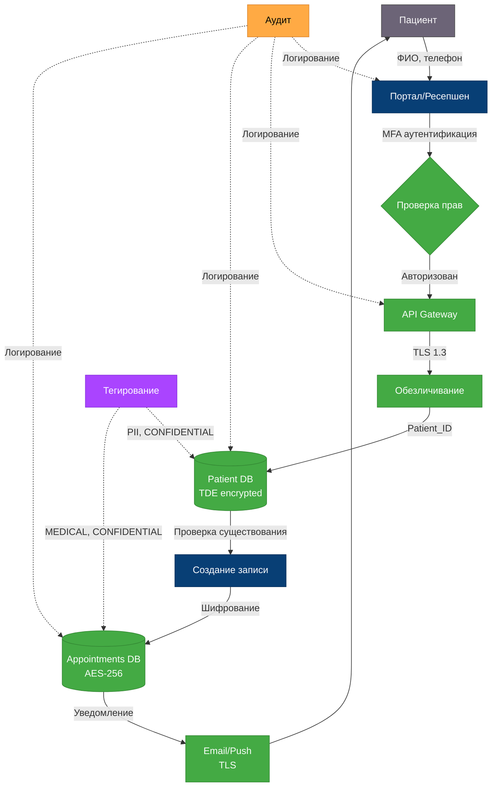

**Меры защиты:**
-  MFA аутентификация
-  TLS 1.3 шифрование
-  Обезличивание (Patient_ID)
-  TDE и AES-256 шифрование БД
-  Полный аудит операций
-  Автоматическое тегирование

---

## Процесс 2: Регистрация нового пациента (TO-BE)

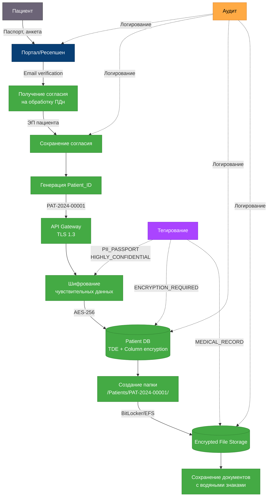

**Меры защиты:**
-  Электронное согласие с ЭП
-  Генерация уникального Patient_ID
-  Шифрование паспортных данных (AES-256)
-  TDE + Column-level encryption
-  Шифрование файлового хранилища (BitLocker)
-  Водяные знаки на документах
-  Полный аудит и тегирование

---

## Процесс 3: Приём пациента врачом (TO-BE)

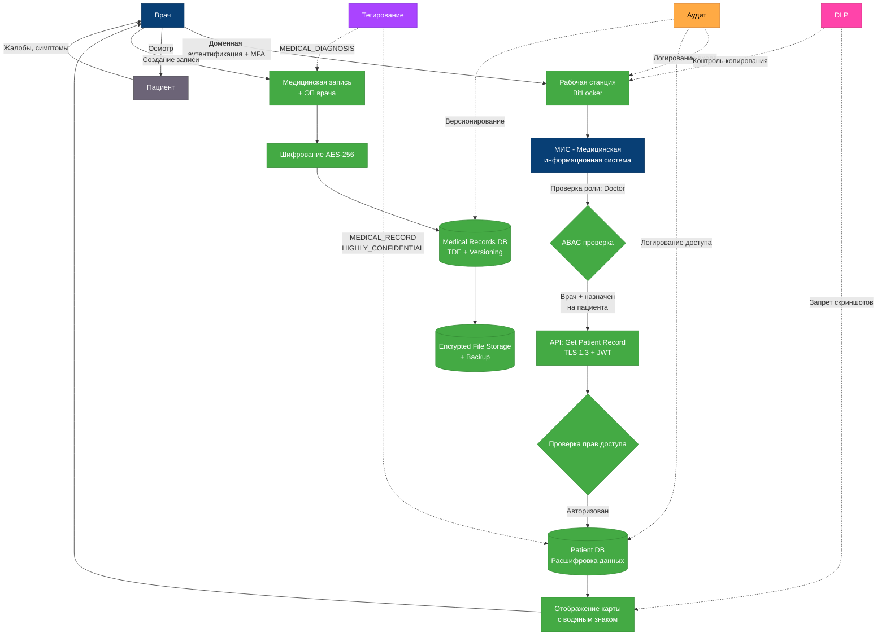

**Меры защиты:**
-  MFA для врачей
-  BitLocker на рабочих станциях
-  ABAC (врач + назначение на пациента)
-  Водяные знаки на документах
-  DLP (запрет скриншотов, копирования)
-  Электронная подпись врача
-  Версионирование всех изменений
-  Зашифрованные резервные копии

---

## Процесс 4: Интеграция с лабораторией (TO-BE)

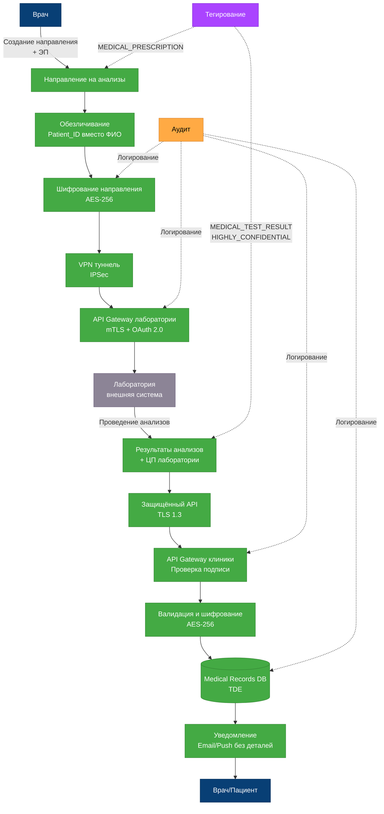

**Меры защиты:**
-  Электронная подпись врача
-  Обезличивание данных (Patient_ID)
-  VPN туннель (IPSec)
-  mTLS (взаимная аутентификация)
-  OAuth 2.0 для API
-  Цифровая подпись лаборатории
-  Проверка целостности данных
-  Уведомления без конфиденциальных данных

---

## Процесс 5: Оплата медицинских услуг (TO-BE)

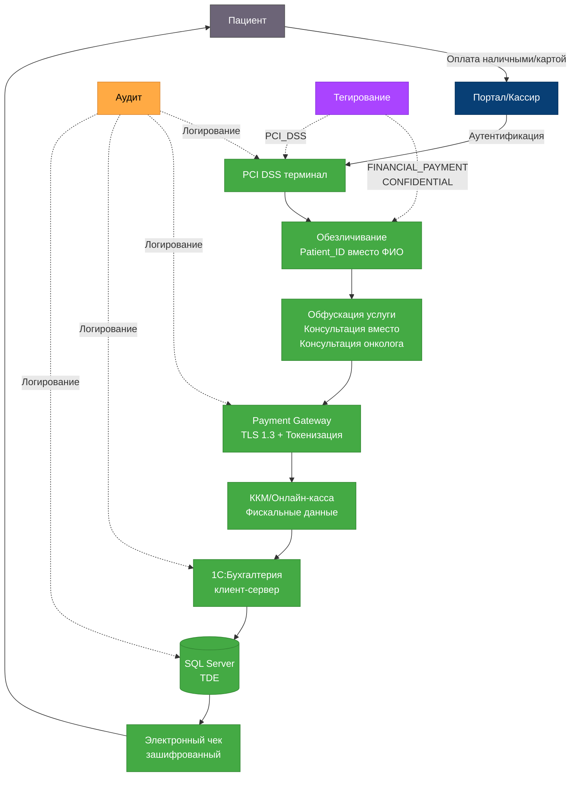

**Меры защиты:**
-  PCI DSS compliant терминал
-  Токенизация данных карты
-  Обезличивание (Patient_ID)
-  Обфускация названия услуги
-  1С в клиент-серверном режиме
-  TDE на уровне SQL Server
-  Зашифрованные электронные чеки
-  Устранение двойного учёта

---

## Процесс 6: Бухгалтерский учёт и процессинг платежей (TO-BE)

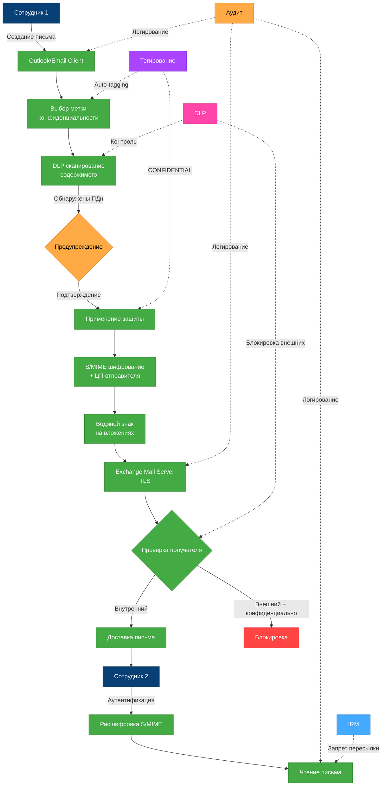

**Меры защиты:**
-  Обязательное тегирование писем
-  DLP сканирование содержимого
-  S/MIME шифрование
-  Цифровая подпись отправителя
-  Водяные знаки на вложениях
-  Блокировка внешних адресов для конфиденциальных данных
-  IRM (запрет пересылки, печати)
-  Полный аудит переписки

---

## Процесс 7: Учёт товарно-материальных ценностей (TO-BE)

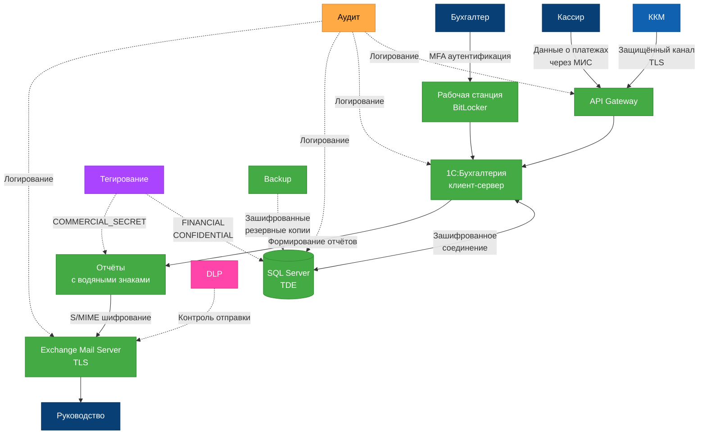

**Меры защиты:**
-  Защищённый канал передачи данных (TLS)
-  Клиент-серверный режим 1С с разграничением доступа
-  TDE шифрование базы данных SQL Server
-  MFA для бухгалтеров
-  BitLocker на рабочих станциях
-  S/MIME шифрование отчётов
-  Водяные знаки на документах
-  DLP контроль отправки финансовых данных
-  Полный аудит всех операций
-  Зашифрованные резервные копии
-  Автоматическое тегирование финансовых данных

---

## Процесс 8: Внутренняя коммуникация (TO-BE)

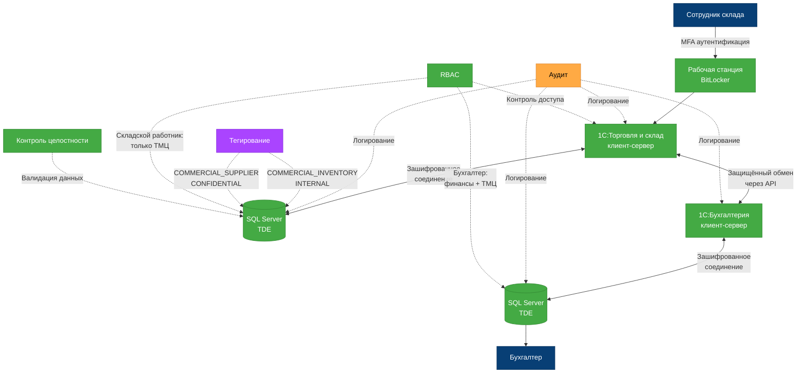

**Меры защиты:**
-  MFA для сотрудников склада
-  BitLocker на рабочих станциях
-  Клиент-серверный режим 1С с разграничением доступа
-  TDE шифрование баз данных SQL Server
-  RBAC - ролевое разграничение доступа (складской работник видит только ТМЦ)
-  Защищённый обмен данными между 1С системами через API
-  Полный аудит всех операций с ТМЦ
-  Автоматическое тегирование коммерческих данных
-  Контроль целостности данных (валидация изменений)
-  Версионирование изменений
-  Защита от несанкционированного изменения данных
