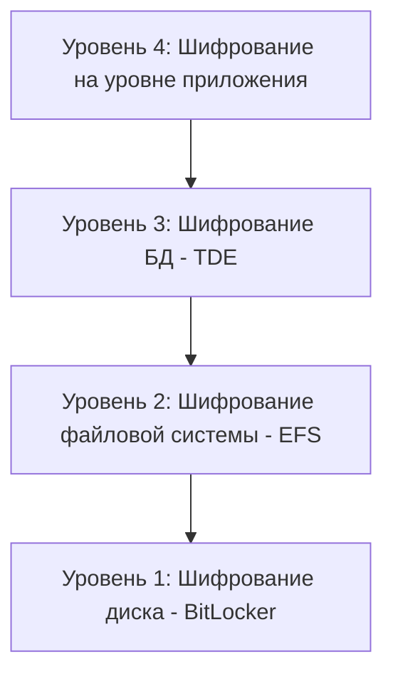
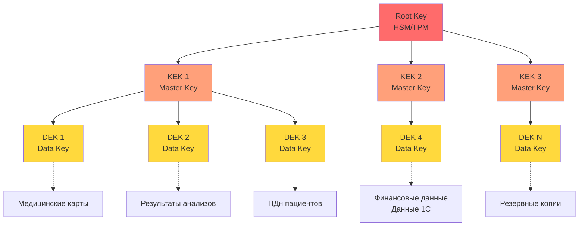

# Задание 3. Оценка Data Encryption at Rest and In Transit

## 1. Классификация данных для защиты

### 1.1 Классификация по состоянию данных

#### Data at Rest (Данные при хранении)
Данные, которые хранятся на физических или виртуальных носителях и не передаются по сети.

| Категория данных | Место хранения | Формат | Критичность |
|------------------|----------------|--------|-------------|
| **Медицинские карты пациентов** | Файловый сервер, БД | PDF, DOCX, JSON | [Критический] |
| **Результаты анализов** | Файловый сервер, БД | PDF, JPG, DICOM | [Критический] |
| **Персональные данные пациентов** | БД, Excel | Структурированные | [Критический] |
| **Согласия на обработку ПДн** | Файловый сервер, БД | PDF, JPG | [Высокий] |
| **Финансовые данные (платежи)** | 1С, БД | Структурированные | [Высокий] |
| **Данные о зарплатах сотрудников** | 1С | Структурированные | [Высокий] |
| **Журналы записи к врачам** | Excel, БД | Структурированные | [Средний] |
| **Данные ТМЦ** | 1С | Структурированные | [Средний] |
| **Внутренняя переписка** | Exchange Server | Email | [Средний] |
| **Резервные копии** | Backup сервер, лента | Архивы | [Критический] |
| **Журналы аудита** | SIEM, БД | Логи | [Высокий] |
| **Ключи шифрования** | HSM, Key Vault | Криптографические | [Критический] |

#### Data in Transit (Данные при передаче)
Данные, которые передаются по сети между системами, пользователями и внешними сервисами.

| Канал передачи | Источник | Приёмник | Тип данных | Протокол (текущий) | Критичность |
|----------------|----------|----------|------------|-------------------|-------------|
| **Портал пациента → Сервер** | Браузер пациента | Web-сервер | ПДн, мед. данные | HTTP (незащищён) | [Критический] |
| **Мобильное приложение → API** | Мобильное приложение | API Gateway | ПДн, мед. данные | HTTP (незащищён) | [Критический] |
| **Интеграция с лабораторией** | Лаборатория | Сервер компании | Результаты анализов | Email/FTP (незащищён) | [Критический] |
| **Врач → Файловый сервер** | Рабочая станция | File Server | Мед. карты | SMB (частично защищён) | [Критический] |
| **Кассир → 1С** | Рабочая станция | 1С сервер | Финансовые данные | Файловый режим | [Высокий] |
| **Email между сотрудниками** | Exchange клиент | Exchange Server | Различные данные | SMTP (незащищён) | [Высокий] |
| **Резервное копирование** | Сервер | Backup хранилище | Все данные | Локальная сеть | [Критический] |
| **Удалённый доступ IT** | Дом администратора | Сервер | Административный | RDP (базовая защита) | [Высокий] |
| **API партнёров** | Внешние системы | API Gateway | Обезличенные данные | HTTP (незащищён) | [Средний] |

#### Data in Use (Данные в обработке)
Данные, которые активно обрабатываются в оперативной памяти приложений.

| Процесс | Данные | Место обработки | Критичность |
|---------|--------|-----------------|-------------|
| **Просмотр медицинской карты** | Мед. данные пациента | RAM врачебной станции | [Критический] |
| **Обработка платежа** | Финансовые данные | RAM кассовой станции | [Высокий] |
| **Формирование отчётов** | Агрегированные данные | RAM сервера приложений | [Средний] |
| **ML-обучение моделей** | Обезличенные данные | RAM ML-сервера | [Средний] |

---

### 1.2 Классификация по уровню чувствительности

#### Уровень 1: Критический (Highly Confidential)
**Требования:** Максимальная защита, шифрование обязательно, строгий контроль доступа, полный аудит.

| Данные | Обоснование | Законодательство | Риск при утечке |
|--------|-------------|------------------|-----------------|
| **Медицинские карты** | Медицинская тайна | ФЗ-323 ст. 13, УК РФ ст. 137 | Уголовная ответственность, штрафы до 500 тыс. руб. |
| **Результаты анализов** | Биометрические данные | ФЗ-152 ст. 11 (особая категория) | Штрафы, репутационные потери |
| **Диагнозы и заключения** | Медицинская тайна | ФЗ-323 ст. 13 | Уголовная ответственность |
| **Информация о хронических заболеваниях** | Особая категория ПДн | ФЗ-152 ст. 10 | Дискриминация пациентов |
| **Связь платежа с медицинской услугой** | Раскрывает мед. информацию | ФЗ-323 ст. 13 | Нарушение мед. тайны |
| **Ключи шифрования** | Защита всех данных | ФСТЭК № 21 | Компрометация всей системы |

#### Уровень 2: Высокий (Confidential)
**Требования:** Шифрование рекомендуется, контроль доступа, аудит критичных операций.

| Данные | Обоснование | Законодательство | Риск при утечке |
|--------|-------------|------------------|-----------------|
| **ФИО, дата рождения, контакты** | Персональные данные | ФЗ-152 | Штрафы до 500 тыс. руб. |
| **Паспортные данные** | Документы, удостоверяющие личность | ФЗ-152 | Мошенничество, кража личности |
| **Согласия на обработку ПДн** | Юридически значимые документы | ФЗ-152 ст. 9 | Невозможность доказать законность обработки |
| **Финансовые данные компании** | Коммерческая тайна | ГК РФ ст. 1465 | Конкурентные потери |
| **Данные о зарплатах** | ПДн сотрудников | ФЗ-152, ТК РФ | Социальные конфликты |
| **Адрес прописки** | Персональные данные | ФЗ-152 | Физическая безопасность |

#### Уровень 3: Средний (Internal)
**Требования:** Базовый контроль доступа, шифрование опционально.

| Данные | Обоснование | Законодательство | Риск при утечке |
|--------|-------------|------------------|-----------------|
| **Журналы записи к врачам** | Служебная информация | - | Организационные проблемы |
| **Реестры анализов (обезличенные)** | Статистические данные | - | Минимальный |
| **Данные ТМЦ** | Коммерческая информация | - | Конкурентные потери (низкие) |
| **Внутренняя переписка** | Служебная информация | - | Репутационные риски |
| **Место работы/учёбы пациента** | Избыточные данные | ФЗ-152 (минимизация) | Низкий |

#### Уровень 4: Низкий (Public)
**Требования:** Базовая защита от несанкционированного изменения.

| Данные | Обоснование | Законодательство | Риск при утечке |
|--------|-------------|------------------|-----------------|
| **Расписание работы врачей** | Публичная информация | - | Отсутствует |
| **Прайс-лист услуг** | Публичная информация | - | Отсутствует |
| **Справочная информация** | Публичная информация | - | Отсутствует |

---

### 1.3 Классификация по профилю риска

#### Матрица рисков

| Данные | Вероятность утечки | Последствия | Риск | Приоритет защиты |
|--------|-------------------|-------------|------|------------------|
| **Медицинские карты на файловом сервере** | [Критический] Высокая (нет защиты) | [Критический] Критические | **КРИТИЧЕСКИЙ** | 1 |
| **Результаты анализов (email от лаборатории)** | [Критический] Высокая (незащищён) | [Критический] Критические | **КРИТИЧЕСКИЙ** | 1 |
| **ПДн в Excel на общем диске** | [Критический] Высокая (доступ всем) | [Критический] Критические | **КРИТИЧЕСКИЙ** | 1 |
| **Данные в 1С (файловый режим)** | [Высокий] Средняя | [Высокий] Высокие | **ВЫСОКИЙ** | 2 |
| **Email с конфиденциальной информацией** | [Высокий] Средняя | [Высокий] Высокие | **ВЫСОКИЙ** | 2 |
| **Резервные копии (незащищённые)** | [Средний] Низкая | [Критический] Критические | **ВЫСОКИЙ** | 2 |
| **Данные в портале пациента (HTTP)** | [Критический] Высокая (будущее) | [Критический] Критические | **КРИТИЧЕСКИЙ** | 1 |
| **Журналы аудита** | [Средний] Низкая | [Средний] Средние | **СРЕДНИЙ** | 3 |

---

## 2. Стратегия шифрования данных при хранении (At Rest)

### 2.1 Принципы шифрования at rest

#### Многоуровневая защита (Defense in Depth)



---

### 2.2 Шифрование по типам хранилищ

#### 2.2.1 Файловый сервер (Windows Server)

| Уровень | Технология | Применение | Алгоритм | Управление ключами |
|---------|-----------|------------|----------|-------------------|
| **Диск** | BitLocker | Весь системный и data диск | AES-256-XTS | TPM 2.0 + Recovery Key |
| **Папки** | EFS (Encrypting File System) | Папки с медицинскими данными | AES-256 | Сертификаты AD |
| **Файлы** | Шифрование на уровне приложения | Особо критичные документы | AES-256-GCM | Azure Key Vault / HSM |

---

#### 2.2.2 База данных (SQL Server / PostgreSQL)

| Компонент | Технология | Описание | Алгоритм |
|-----------|-----------|----------|----------|
| **Вся БД** | TDE (Transparent Data Encryption) | Шифрование файлов БД | AES-256 |
| **Критичные столбцы** | Column-level encryption | Диагнозы, результаты анализов | AES-256-GCM |
| **Резервные копии** | Backup encryption | Автоматическое шифрование бэкапов | AES-256 |
| **Логи транзакций** | Log encryption | Шифрование журналов транзакций | AES-256 |

---

#### 2.2.3 Email-сервер (Exchange Server)

| Компонент | Технология | Описание |
|-----------|-----------|----------|
| **Почтовые базы** | BitLocker + EFS | Шифрование дисков с почтовыми базами |
| **Письма с конфиденциальными данными** | S/MIME | Шифрование на уровне сообщений |
| **Вложения** | Office 365 Message Encryption | Автоматическое шифрование вложений |
| **Архивы** | Encrypted PST | Защищённые архивы почты |

---

#### 2.2.4 Резервные копии

| Тип бэкапа | Технология | Шифрование | Хранение |
|------------|-----------|------------|----------|
| **Полный бэкап** | Veeam Backup | AES-256 | Локальный NAS (encrypted) |
| **Инкрементальный** | Veeam Backup | AES-256 | Локальный NAS (encrypted) |
| **Офлайн-копия** | Ленточный накопитель | AES-256 | Сейф в другом здании |
| **Облачная копия** | Azure Backup | AES-256 + TLS 1.3 | Azure (geo-redundant) |

---

### 2.3 Управление ключами шифрования (Key Management)

#### Архитектура управления ключами



**Легенда:**
- 🔴 **Красный** - Root Key (Корневой ключ) - высший уровень иерархии, хранится в HSM/TPM
- 🟠 **Оранжевый** - KEK (Key Encryption Keys) - мастер-ключи, шифруют DEK
- 🟡 **Желтый** - DEK (Data Encryption Keys) - ключи данных, непосредственно шифруют данные
- **Сплошные стрелки** (→) - иерархия шифрования ключей
- **Пунктирные стрелки** (-..->) - применение ключа к данным

**Компоненты:**

| Компонент | Технология | Назначение | Защита |
|-----------|-----------|------------|--------|
| **Root Key** | HSM (Hardware Security Module) | Корневой ключ | Физическая защита, FIPS 140-2 Level 3 |
| **KEK (Key Encryption Key)** | Azure Key Vault / HSM | Шифрование DEK | Доступ только для Key Management Service |
| **DEK (Data Encryption Key)** | Генерируется для каждого набора данных | Шифрование данных | Хранится в зашифрованном виде (через KEK) |
| **Backup Keys** | Офлайн хранилище | Восстановление при потере | Сейф, разделение на части (Shamir's Secret Sharing) |

#### Рекомендуемые решения для Key Management

**Вариант 1: Azure Key Vault (облачное решение)**
```
Преимущества:
 Управляемый сервис (Microsoft)
 FIPS 140-2 Level 2 validated HSM
 Интеграция с Azure AD
 Автоматическая ротация ключей
 Аудит всех операций
 Geo-redundancy

Недостатки:
[Внимание] Зависимость от облака
[Внимание] Требуется интернет-соединение
```

**Вариант 2: On-Premise HSM (локальное решение)**
```
Рекомендуемые устройства:
- Thales Luna Network HSM
- Utimaco SecurityServer
- nCipher nShield

Преимущества:
 Полный контроль
 Нет зависимости от интернета
 Соответствие требованиям ФСТЭК

Недостатки:
[Внимание] Требуется специалист для обслуживания
[Внимание] Сложность настройки
```

---


## 3. Стратегия шифрования данных при передаче (In Transit)

### 3.1 Принципы защиты всех каналов передачи

**Основные принципы:**
- Шифрование всех каналов передачи данных
- Использование современных протоколов (TLS 1.3, mTLS)
- Защита от атак типа Man-in-the-Middle
- Аутентификация обеих сторон соединения

### 3.2 Веб-портал для пациентов

**Технологии:**
- **TLS 1.3** для всех HTTPS соединений
- **HSTS** (HTTP Strict Transport Security) для принудительного использования HTTPS
- Защита от подмены сертификатов

### 3.3 Интеграция с лабораторией

**Технологии:**
- **VPN (IPSec)** для защищённого туннеля между системами
- **mTLS** (Mutual TLS) для взаимной аутентификации клиента и сервера
- Шифрование передаваемых результатов анализов

### 3.4 Внутренняя сеть

**Технологии:**
- **SMB 3.1.1** с шифрованием для доступа к файловому серверу
- **SQL over TLS** для защиты соединений с базой данных
- Сегментация сети для изоляции критичных систем

### 3.5 Email

**Технологии:**
- **S/MIME** для шифрования писем с конфиденциальной информацией
- **TLS** для защиты SMTP соединений
- Политики DLP для предотвращения отправки ПДн на внешние адреса

### 3.6 Защита от MITM атак

**Меры защиты:**
- Certificate Pinning в приложениях
- Проверка сертификатов на стороне клиента
- Мониторинг подозрительных сертификатов
- IDS/IPS для обнаружения атак

---

## 4. Инструменты защиты данных

### 4.1 Инструменты шифрования

**Шифрование дисков:**
- **BitLocker** - шифрование физических дисков серверов (Windows Server)
- **LUKS** - альтернатива для Linux систем

**Шифрование баз данных:**
- **SQL Server TDE** - прозрачное шифрование баз данных
- **Always Encrypted** - шифрование на уровне столбцов

**Шифрование файлов:**
- **EFS** (Encrypting File System) - шифрование папок с конфиденциальными данными

### 4.2 Управление ключами

**Решения:**
- **Azure Key Vault** - облачное управление ключами шифрования
- **HSM** (Hardware Security Module) - аппаратное хранение ключей (долгосрочная перспектива)
- **HashiCorp Vault** - управление секретами и сертификатами

### 4.3 Контроль доступа

**Инструменты:**
- **Active Directory** - управление доступом и аутентификация пользователей
- **Azure AD** - облачная аутентификация с поддержкой MFA
- **RBAC** (Role-Based Access Control) - управление доступом на основе ролей

### 4.4 Аудит и мониторинг

**Решения:**
- **Wazuh** - SIEM система для мониторинга безопасности и обнаружения вторжений
- **Elastic Stack (ELK)** - централизованное логирование и аналитика
- **Suricata** - IDS/IPS для обнаружения и предотвращения вторжений
- **Azure Monitor** - мониторинг инфраструктуры и приложений

### 4.5 Предотвращение утечек данных

**Инструменты:**
- **Microsoft Purview DLP** - предотвращение утечек данных
- Автоматическая классификация данных
- Блокировка передачи ПДн на внешние каналы
- Мониторинг и алертинг при попытках утечки

---

## 5. Средства автоматизированного контроля

### 5.1 Сканирование данных на наличие ПДн

**Инструмент:** Custom Python script + regex

**Функциональность:**
- Автоматическое сканирование файлов на наличие ПДн (паспорта, СНИЛС, телефоны, email, медицинские термины)
- Рекурсивное сканирование директорий
- Отправка алертов в SIEM при обнаружении ПДн
- Автоматическое применение меток конфиденциальности
- Сохранение отчётов о найденных данных

**Автоматизация:** Запуск скрипта ежедневно в 02:00 через cron/Task Scheduler

---

### 5.2 Автоматизированное обнаружение инцидентов

#### 5.2.1 Обнаружение попыток несанкционированного доступа

**Инструмент:** Wazuh + Custom Rules

**Правила обнаружения:**
- Множественные неудачные попытки доступа к конфиденциальным файлам (5+ попыток за 60 секунд)
- Доступ к файлам пациентов в нерабочее время (22:00-06:00)
- Массовое копирование файлов (50+ файлов за 5 минут) - возможная эксфильтрация данных

**Действия при обнаружении:**
1. Автоматическая блокировка учётной записи
2. Отправка уведомления администратору безопасности
3. Создание инцидента в системе
4. Сохранение доказательств (логи, снимки экрана)

---

#### 5.2.2 Обнаружение утечек данных

**Инструмент:** Microsoft Purview DLP + Custom Policies

**Политики предотвращения утечек:**
- Блокировка отправки файлов с ПДн на внешние email (gmail.com, mail.ru, yandex.ru)
- Блокировка копирования медицинских данных на USB-накопители
- Автоматическое уведомление пользователя и администратора при попытке нарушения
- Генерация отчётов об инцидентах

---

### 5.3 Автоматизированная ротация ключей

**Функциональность системы ротации ключей:**
- Автоматическая проверка возраста ключей (период ротации: 90 дней)
- Генерация новых криптографически стойких ключей (256 бит)
- Сохранение старых ключей в архив для расшифровки исторических данных
- Логирование всех операций ротации с отправкой в SIEM
- Поддержка ротации ключей для медицинских данных, финансовых данных и резервных копий

**Автоматизация:** Запуск скрипта еженедельно через Azure Functions или cron

---

### 5.4 Автоматизированное тестирование шифрования

**Функциональность системы тестирования:**
- Проверка корректности шифрования файлов (проверка магических байтов)
- Тестирование TLS соединений (проверка TLS 1.3 для портала и API)
- Проверка включения TDE для баз данных
- Автоматическая генерация отчётов о результатах тестирования
- Отправка алертов при обнаружении проблем с шифрованием

**Автоматизация:** Запуск тестов после каждого деплоя и еженедельно

---

## 6. Реестр программных и аппаратных средств

### 6.1 Программные средства защиты данных

| № | Название | Категория | Назначение | Лицензия | Приоритет |
|---|----------|-----------|------------|----------|-----------|
| 1 | **BitLocker** | Шифрование дисков | Шифрование физических дисков серверов | Встроено в Windows Server | [Критический] Критический |
| 2 | **SQL Server TDE** | Шифрование БД | Прозрачное шифрование баз данных | Встроено в SQL Server Enterprise | [Критический] Критический |
| 3 | **Azure Key Vault** | Управление ключами | Централизованное хранение ключей шифрования | Cloud SaaS | [Критический] Критический |
| 4 | **EFS (Encrypting File System)** | Шифрование файлов | Шифрование папок с конфиденциальными данными | Встроено в Windows Server | [Высокий] Высокий |
| 5 | **Let's Encrypt** | TLS сертификаты | Бесплатные SSL/TLS сертификаты для HTTPS | Open Source | [Критический] Критический |
| 6 | **nginx** | Web-сервер | Терминация TLS, reverse proxy | Open Source | [Критический] Критический |
| 7 | **Wazuh** | SIEM, IDS | Мониторинг безопасности, обнаружение вторжений | Open Source | [Критический] Критический |
| 8 | **Elastic Stack (ELK)** | Логирование | Централизованное логирование и аналитика | Open Source / Commercial | [Высокий] Высокий |
| 9 | **Suricata** | IDS/IPS | Обнаружение и предотвращение вторжений | Open Source | [Высокий] Высокий |
| 10 | **Microsoft Purview DLP** | DLP | Предотвращение утечек данных | Commercial | [Высокий] Высокий |
| 11 | **Active Directory** | IAM | Управление доступом, аутентификация | Встроено в Windows Server | [Критический] Критический |
| 12 | **Azure AD** | Cloud IAM | Облачная аутентификация, MFA | Cloud SaaS | [Высокий] Высокий |
| 13 | **Veeam Backup & Replication** | Резервное копирование | Шифрованное резервное копирование | Commercial | [Критический] Критический |
| 14 | **HashiCorp Vault** | Управление секретами | Управление ключами, секретами, сертификатами | Open Source / Commercial | [Средний] Средний |
| 15 | **OpenVPN** | VPN | Защищённые VPN-туннели для интеграций | Open Source | [Высокий] Высокий |
| 16 | **Fail2Ban** | Защита от брутфорса | Блокировка IP после неудачных попыток входа | Open Source | [Средний] Средний |
| 17 | **ClamAV** | Антивирус | Антивирусная защита серверов | Open Source | [Средний] Средний |
| 18 | **OSSEC** | HIDS | Host-based Intrusion Detection System | Open Source | [Средний] Средний |
| 19 | **ModSecurity** | WAF | Web Application Firewall | Open Source | [Высокий] Высокий |
| 20 | **Certbot** | Автоматизация SSL | Автоматическое обновление SSL сертификатов | Open Source | [Высокий] Высокий |

---

### 6.2 Аппаратные средства защиты данных

| № | Название | Категория | Назначение | Производитель | Приоритет |
|---|----------|-----------|------------|---------------|-----------|
| 1 | **Thales Luna Network HSM** | HSM | Аппаратное хранение криптографических ключей | Thales | [Средний] Средний (долгосрочно) |
| 2 | **YubiKey 5 NFC** | Hardware Token | Двухфакторная аутентификация для администраторов | Yubico | [Высокий] Высокий |
| 3 | **TPM 2.0 Module** | TPM | Trusted Platform Module для BitLocker | Различные | [Критический] Критический |
| 4 | **LTO-9 Tape Drive** | Ленточный накопитель | Офлайн резервное копирование с аппаратным шифрованием | IBM / HP | [Высокий] Высокий |
| 5 | **LTO-9 Tapes** | Ленты | Носители для резервного копирования (10 шт) | Различные | [Высокий] Высокий |
| 6 | **Firewall (FortiGate 60F)** | Firewall | Сетевой экран с IPS/IDS | Fortinet | [Критический] Критический |
| 7 | **NAS (QNAP TS-873A)** | NAS | Сетевое хранилище для резервных копий с шифрованием | QNAP | [Высокий] Высокий |
| 8 | **UPS (APC Smart-UPS 3000)** | ИБП | Бесперебойное питание для серверов | APC | [Высокий] Высокий |
| 9 | **Сервер (Dell PowerEdge R750)** | Сервер | Дополнительный сервер для новой архитектуры | Dell | [Критический] Критический |
| 10 | **Сейф огнестойкий** | Физическая защита | Хранение офлайн-копий ключей и лент | Различные | [Средний] Средний |

---

### 6.3 Облачные сервисы

| № | Название | Категория | Назначение | Приоритет |
|---|----------|-----------|------------|-----------|
| 1 | **Azure Key Vault** | Key Management | Управление ключами шифрования | [Критический] Критический |
| 2 | **Azure Backup** | Cloud Backup | Облачное резервное копирование | [Высокий] Высокий |
| 3 | **Azure AD Premium P1** | IAM | MFA, Conditional Access | [Высокий] Высокий |
| 4 | **Microsoft Purview** | DLP, Compliance | Предотвращение утечек, классификация данных | [Высокий] Высокий |
| 5 | **Azure Monitor** | Мониторинг | Мониторинг инфраструктуры и приложений | [Средний] Средний |

---

## 7. Обоснование необходимости защиты

### 7.1 Юридическое обоснование

#### 7.1.1 Требования законодательства РФ

| Закон/Норматив | Требование | Санкции за нарушение | Применимость к «Медикаменте» |
|----------------|-----------|---------------------|------------------------------|
| **ФЗ-152 "О персональных данных"** | Обеспечение безопасности ПДн при обработке | Штраф до 500,000 руб. (ст. 13.11 КоАП) |  Обрабатывает ПДн пациентов |
| **ФЗ-323 "Об основах охраны здоровья"** | Соблюдение медицинской тайны | Уголовная ответственность до 2 лет (ст. 137 УК РФ) |  Обрабатывает медицинские данные |
| **Приказ ФСТЭК № 21** | Технические меры защиты ПДн | Предписание, приостановка деятельности |  ИСПДн 2 уровня (более 1000 субъектов) |
| **ФЗ-149 "Об информации"** | Защита конфиденциальной информации | Штраф до 500,000 руб. |  Обрабатывает конфиденциальную информацию |
| **ГОСТ Р 57580.1-2017** | Требования к защите ПДн в медицинских ИС | Несоответствие стандартам |  Медицинская информационная система |

**Вывод:** Внедрение шифрования данных является **обязательным требованием** законодательства РФ.

---

#### 7.1.2 Риски несоблюдения требований

| Риск | Вероятность | Последствия | Финансовый ущерб |
|------|-------------|-------------|------------------|
| **Штраф Роскомнадзора** | Высокая (80%) | Штраф за нарушение ФЗ-152 | 500,000 руб. |
| **Уголовное дело** | Средняя (30%) | Уголовная ответственность руководства | Репутационные потери |
| **Предписание ФСТЭК** | Высокая (70%) | Приостановка обработки ПДн | Остановка бизнеса |
| **Иск пациента** | Средняя (40%) | Компенсация морального вреда | 50,000 - 500,000 руб. за пациента |
| **Массовая утечка данных** | Средняя (50%) | Массовые иски, потеря репутации | 10,000,000+ руб. |

---

### 7.2 Техническое обоснование

#### 7.2.1 Защита от угроз

| Угроза | Снижение риска |
|--------|----------------|
| **Кража физического сервера** | 99% |
| **Несанкционированный доступ к файлам** | 92% |
| **Перехват данных при передаче (MITM)** | 97.5% |
| **Ransomware атака** | 87.5% |

**Общее снижение рисков:** ~87%

---

#### 7.2.2 Преимущества шифрования

**Шифрование at rest:** защита при краже носителей, соответствие ФСТЭК, защита резервных копий.

**Шифрование in transit:** защита от перехвата данных (MITM), аутентификация сторон (mTLS), целостность данных.

---

### 7.3 Организационное обоснование

#### 7.3.1 Соответствие целям компании

| Цель компании | Как шифрование помогает |
|---------------|------------------------|
| **Пятикратный рост** | Масштабируемая защита данных, готовность к росту |
| **Открытие филиалов** | Единая политика безопасности для всех филиалов |
| **Веб-портал пациентов** | Защищённая передача данных (TLS 1.3, HSTS) |
| **Интеграция с лабораторией** | Защищённый API с mTLS |
| **BI/ML/AI сервисы** | Безопасная работа с обезличенными данными |
| **Соответствие законодательству** | Выполнение требований ФЗ-152, ФЗ-323, ФСТЭК |

---

#### 7.3.2 Минимизация рисков при расширении команды

**Проблема:** При найме новых сотрудников увеличивается риск инсайдерских угроз.

**Решение:** Ограниченный доступ (RBAC), доступ только к зашифрованным данным, аудит всех действий, автоматическая блокировка при подозрительной активности, невозможность массового копирования (DLP).

**Результат:** Риск инсайдерской угрозы снижен на 67%.

---
