# Диаграмма Исикавы (Ishikawa / Fishbone Diagram)

## Анализ узких мест при миграции на микросервисную архитектуру

```mermaid
graph LR
 %% Основная проблема (голова рыбы)
 Problem["<b>СНИЖЕНИЕ ПРОИЗВОДИТЕЛЬНОСТИ<br/>И РАБОТОСПОСОБНОСТИ СИСТЕМЫ<br/>ПРИ МИГРАЦИИ</b>"]

 %% Главный хребет
 Spine[" "] -.-> Problem

 %% Категория 1: ИНФРАСТРУКТУРА (сверху)
 Infra["<b>ИНФРАСТРУКТУРА</b>"] --> Spine
 Infra1["Недостаточная<br/>производительность<br/>серверов"] --> Infra
 Infra2["Проблемы с сетью<br/>(latency, bandwidth)"] --> Infra
 Infra3["Отсутствие<br/>отказоустойчивости"] --> Infra
 Infra4["Сложность<br/>настройки K8s"] --> Infra

 %% Категория 2: ПРОГРАММНОЕ ОБЕСПЕЧЕНИЕ (сверху)
 Software["<b>ПРОГРАММНОЕ<br/>ОБЕСПЕЧЕНИЕ</b>"] --> Spine
 Soft1["Ошибки в коде<br/>микросервисов"] --> Software
 Soft2["Проблемы с<br/>распределёнными<br/>транзакциями"] --> Software
 Soft3["Memory leaks"] --> Software
 Soft4["Неоптимальные<br/>запросы к БД"] --> Software
 Soft5["Отсутствие<br/>кэширования"] --> Software

 %% Категория 3: ИНТЕГРАЦИЯ (сверху)
 Integration["<b>ИНТЕГРАЦИЯ</b>"] --> Spine
 Integ1["Проблемы с API<br/>лаборатории"] --> Integration
 Integ2["Несовместимость<br/>ККМ"] --> Integration
 Integ3["Задержки в<br/>синхронизации"] --> Integration
 Integ4["Ошибки при<br/>обмене данными"] --> Integration

 %% Категория 4: ПЕРСОНАЛ (снизу)
 Personnel["<b>ПЕРСОНАЛ</b>"] --> Spine
 Pers1["Недостаток<br/>компетенций"] --> Personnel
 Pers2["Отсутствие опыта<br/>с Kubernetes"] --> Personnel
 Pers3["Сопротивление<br/>изменениям"] --> Personnel
 Pers4["Нехватка<br/>ресурсов (людей)"] --> Personnel

 %% Категория 5: ПРОЦЕССЫ (снизу)
 Processes["<b>ПРОЦЕССЫ</b>"] --> Spine
 Proc1["Отсутствие<br/>тестирования"] --> Processes
 Proc2["Неправильная<br/>декомпозиция"] --> Processes
 Proc3["Отсутствие<br/>мониторинга"] --> Processes
 Proc4["Недостаточное<br/>планирование"] --> Processes

 %% Категория 6: ДАННЫЕ (снизу)
 Data["<b>ДАННЫЕ</b>"] --> Spine
 Data1["Несовместимость<br/>схем данных"] --> Data
 Data2["Потеря данных<br/>при миграции"] --> Data
 Data3["Длительный<br/>downtime"] --> Data
 Data4["Проблемы с<br/>целостностью"] --> Data

 %% Категория 7: БЕЗОПАСНОСТЬ И ШИФРОВАНИЕ (снизу)
 Security["<b>БЕЗОПАСНОСТЬ<br/>И ШИФРОВАНИЕ</b>"] --> Spine
 Sec1["Сложность внедрения<br/>шифрования"] --> Security
 Sec2["Снижение производительности<br/>из-за шифрования"] --> Security
 Sec3["Управление ключами<br/>(Key Management)"] --> Security
 Sec4["Отсутствие TLS<br/>между сервисами"] --> Security

 %% Стили
 classDef problemStyle fill:#f8cecc,stroke:#b85450,stroke-width:3px,color:#000
 classDef categoryStyle fill:#e1d5e7,stroke:#9673a6,stroke-width:2px,color:#000,font-weight:bold
 classDef infraStyle fill:#fff2cc,stroke:#d6b656,stroke-width:1px,color:#000
 classDef softwareStyle fill:#dae8fc,stroke:#6c8ebf,stroke-width:1px,color:#000
 classDef integrationStyle fill:#d5e8d4,stroke:#82b366,stroke-width:1px,color:#000
 classDef personnelStyle fill:#f8cecc,stroke:#b85450,stroke-width:1px,color:#000
 classDef processStyle fill:#e1d5e7,stroke:#9673a6,stroke-width:1px,color:#000
 classDef dataStyle fill:#fff2cc,stroke:#d6b656,stroke-width:1px,color:#000

 classDef securityStyle fill:#ffe6cc,stroke:#d79b00,stroke-width:1px,color:#000

 class Problem problemStyle
 class Infra,Software,Integration,Personnel,Processes,Data,Security categoryStyle
 class Infra1,Infra2,Infra3,Infra4 infraStyle
 class Soft1,Soft2,Soft3,Soft4,Soft5 softwareStyle
 class Integ1,Integ2,Integ3,Integ4 integrationStyle
 class Pers1,Pers2,Pers3,Pers4 personnelStyle
 class Proc1,Proc2,Proc3,Proc4 processStyle
 class Data1,Data2,Data3,Data4 dataStyle
 class Sec1,Sec2,Sec3,Sec4 securityStyle
```

**Легенда:**
- 🔴 **Красный** (с жирной обводкой) - Основная проблема (голова рыбы)
- 🟣 **Фиолетовый** (жирная обводка) - Категории причин (главные "кости")
- 🟡 **Жёлтый** - Причины категории "Инфраструктура"
- 🔵 **Синий** - Причины категории "Программное обеспечение"
- 🟢 **Зелёный** - Причины категории "Интеграция"
- 🔴 **Светло-красный** - Причины категории "Персонал"
- 🟣 **Светло-фиолетовый** - Причины категории "Процессы"
- 🟡 **Светло-жёлтый** - Причины категории "Данные"
- 🟠 **Оранжевый** - Причины категории "Безопасность и шифрование"

---

## Описание категорий

### 1. ИНФРАСТРУКТУРА
Проблемы, связанные с серверным оборудованием, сетью и инфраструктурой:
- **Недостаточная производительность серверов** - текущие мощности не справятся с нагрузкой
- **Проблемы с сетью** - высокая latency, недостаточная bandwidth
- **Отсутствие отказоустойчивости** - нет резервирования, Single Point of Failure
- **Сложность настройки K8s** - команда не имеет опыта с Kubernetes

### 2. ПРОГРАММНОЕ ОБЕСПЕЧЕНИЕ
Проблемы в коде и архитектуре приложения:
- **Ошибки в интеграционном слое** - баги при разработке API-адаптера для 1С
- **Проблемы с распределёнными транзакциями** - сложность обеспечения ACID
- **Memory leaks** - утечки памяти в новом коде
- **Неоптимальные запросы к БД** - N+1 проблема, отсутствие индексов
- **Отсутствие кэширования** - каждый запрос идёт в БД

### 3. ИНТЕГРАЦИЯ
Проблемы взаимодействия с внешними системами:
- **Проблемы с API лаборатории** - нестабильное API, таймауты
- **Несовместимость ККМ** - старое оборудование не поддерживает новые протоколы
- **Задержки в синхронизации** - асинхронная обработка данных
- **Ошибки при обмене данными** - потеря сообщений, дубликаты

### 4. ПЕРСОНАЛ
Проблемы, связанные с командой разработки:
- **Недостаток компетенций** - команда не знает микросервисы, Java, Kubernetes
- **Отсутствие опыта с Kubernetes** - никто не умеет настраивать и поддерживать K8s
- **Сопротивление изменениям** - разработчики привыкли к 1С
- **Нехватка ресурсов** - команда из 3 человек не справится с миграцией

### 5. ПРОЦЕССЫ
Проблемы в процессах разработки и эксплуатации:
- **Отсутствие тестирования** - нет unit/integration тестов, всё тестируется вручную
- **Неправильная декомпозиция** - монолит разбит неправильно, получился distributed monolith
- **Отсутствие мониторинга** - нет observability, сложно найти проблемы
- **Недостаточное планирование** - нет чёткого плана миграции, всё делается "на ходу"

### 6. ДАННЫЕ
Проблемы с данными и их миграцией:
- **Несовместимость схем данных** - структура данных в 1С и PostgreSQL различается
- **Потеря данных при миграции** - риск потери данных при переносе
- **Длительный downtime** - миграция может занять 4-8 часов
- **Проблемы с целостностью** - нарушение связей между данными

### 7. БЕЗОПАСНОСТЬ И ШИФРОВАНИЕ
Проблемы, связанные с внедрением шифрования данных (на основе Task 3):
- **Сложность внедрения шифрования** - необходимо шифровать данные at rest и in transit
- **Снижение производительности из-за шифрования** - AES-256 создаёт overhead 10-15%
- **Управление ключами (Key Management)** - нужен HSM или Key Vault, ротация ключей
- **Отсутствие TLS между сервисами** - межсервисная коммуникация не защищена

---

## Критичность проблем

### [Критический] Критические (требуют немедленного решения)
1. Недостаточная производительность серверов
2. Отсутствие отказоустойчивости
3. Ошибки в коде микросервисов
4. Проблемы с распределёнными транзакциями
5. Недостаток компетенций в команде
6. Отсутствие тестирования
7. Несовместимость схем данных
8. Длительный downtime при миграции
9. **Отсутствие TLS между сервисами** (новое из Task 3)
10. **Управление ключами шифрования** (новое из Task 3)

### [Высокий] Высокие (требуют решения в ближайшее время)
1. Сложность настройки K8s
2. Проблемы с сетью
3. Memory leaks
4. Неоптимальные запросы к БД
5. Проблемы с API лаборатории
6. Нехватка ресурсов (людей)
7. Неправильная декомпозиция
8. Отсутствие мониторинга
9. Потеря данных при миграции
10. **Сложность внедрения шифрования** (новое из Task 3)
11. **Снижение производительности из-за шифрования** (новое из Task 3)

### [Средний] Средние (можно решить позже)
1. Отсутствие кэширования
2. Несовместимость ККМ
3. Задержки в синхронизации
4. Ошибки при обмене данными
5. Сопротивление изменениям
6. Недостаточное планирование
7. Проблемы с целостностью данных
