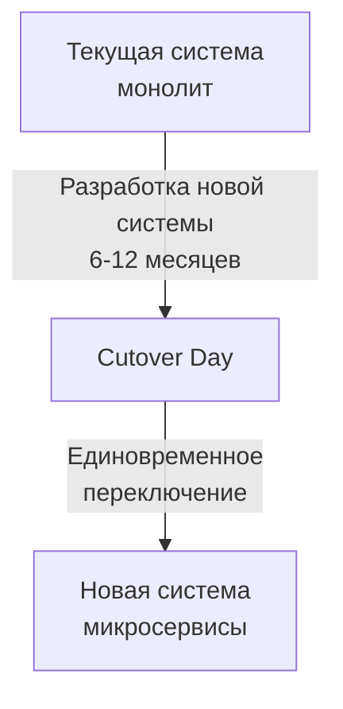
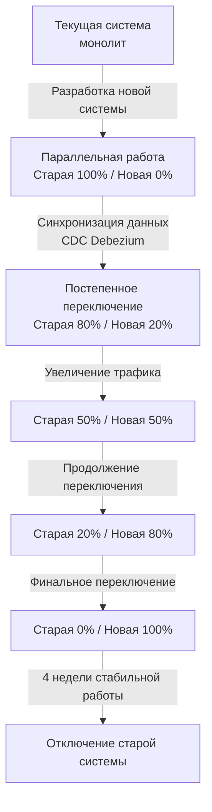
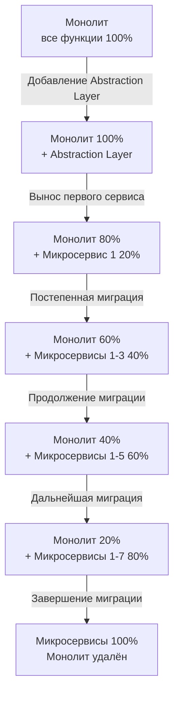

# Задание 5. Разработка cutover-плана миграции

## Оглавление
1. [Анализ текущей ситуации](#1-анализ-текущей-ситуации)
2. [Сравнение стратегий миграции](#2-сравнение-стратегий-миграции)
3. [Выбор и обоснование стратегии](#3-выбор-и-обоснование-стратегии)
4. [Детальный cutover-план](#4-детальный-cutover-план)
5. [Критические моменты и меры минимизации рисков](#5-критические-моменты-и-меры-минимизации-рисков)
6. [Управление рисками](#6-управление-рисками)
7. [Распределение ролей и ответственности](#7-распределение-ролей-и-ответственности)
8. [План отката (Rollback Plan)](#8-план-отката-rollback-plan)

---

## 1. Анализ текущей ситуации

### 1.1 Текущая система (AS-IS)

**Архитектура:**
- Монолитная система на физическом сервере Windows Server 2022
- 1С:Бухгалтерия и 1С:Торговля (файловый режим)
- Excel файлы для учёта пациентов и журналов
- Exchange Mail Server (локальный)
- Файловый сервер для медицинских документов

**Характеристики:**
- 35 сотрудников (20 административных + 15 медицинских)
- ~100-150 пациентов в день
- ~100 ГБ данных
- Один офис
- Отсутствие масштабируемости
- Single Point of Failure (SPOF)

**Проблемы:**
- Невозможность масштабирования
- Отсутствие отказоустойчивости
- Ручная обработка данных
- Нет API для интеграций
- Несоответствие требованиям безопасности (ФЗ-152, ФЗ-323)

---

### 1.2 Целевая система (TO-BE)

**Архитектура:**
Система построена на принципах **Privacy by Design** с многоуровневой архитектурой:

**1. Application & Integration Layer (Прикладной уровень):**
- **Patient Portal** - личный кабинет пациента (веб + мобильное приложение)
- **Employee Portal** - портал для сотрудников (ресепшен, врачи, бухгалтерия, склад)
- **CRM System** - управление взаимоотношениями с пациентами
- **API Gateway** - защищённый шлюз для интеграций (REST API, mTLS)
- **Laboratory Integration** - интеграция с лабораторией анализов через API

**2. Security & Access Control Layer (Безопасность и контроль доступа):**
- **IAM** - централизованное управление идентификацией и доступом
- **Authentication Service** - аутентификация пользователей (MFA, SSO)
- **Authorization Service** - авторизация и контроль доступа (RBAC/ABAC)

**3. Data Protection Layer (Защита данных):**
- **Encryption Service** - шифрование данных в покое и в движении (AES-256, TLS 1.3)
- **Data Tagging Service** - автоматическая маркировка конфиденциальных данных
- **DLP (Data Loss Prevention)** - контроль передачи конфиденциальных данных

**4. Audit & Monitoring Layer (Аудит и мониторинг):**
- **Audit & Logging Service** - журналирование всех операций с ПДн
- **SIEM** - обнаружение инцидентов и аномалий

**5. Data Lifecycle Management Layer (Управление жизненным циклом данных):**
- **Consent Management** - управление согласиями пациентов на обработку ПДн
- **Right to be Forgotten** - право на забвение и удаление данных (GDPR/ФЗ-152)

**6. Legacy Systems Integration:**
- **1С:Бухгалтерия предприятия** - интеграция через портал
- **1С:Торговля и склад** - интеграция через портал
- **File System** - доступ к файлам через портал
- **ККМ** - интеграция с контрольно-кассовыми машинами

**Технологический стек:**
- Backend: Java (технический директор владеет Java)
- Databases: PostgreSQL, ClickHouse, Elasticsearch
- Container Orchestration: Kubernetes
- Monitoring: Victoria Metrics, Prometheus, Grafana
- Message Queue: Kafka/RabbitMQ
- API Gateway: nginx/Kong

**Ожидаемые характеристики:**
- 175 сотрудников (5x рост от текущих 35)
- ~500-750 пациентов в день (5x рост от текущих 100-150)
- ~500 ГБ данных (5x рост от текущих 100 ГБ)
- Множество филиалов (расширение бизнеса)
- Горизонтальное масштабирование
- Отказоустойчивость (99.9% uptime)
- Соответствие ФЗ-152, ФЗ-323

---

### 1.3 Бизнес-цели миграции

| Цель | Метрика успеха | Приоритет |
|------|----------------|-----------|
| **Масштабируемость** | Поддержка 5x роста без деградации | Критический |
| **Отказоустойчивость** | Uptime 99.9% | Критический |
| **Производительность** | Response time < 500 мс | Критический |
| **Безопасность** | Соответствие ФЗ-152, ФЗ-323 | Критический |
| **Автоматизация** | 80% процессов автоматизировано | Высокий |
| **Гибкость** | Деплой новых фич < 1 день | Высокий |

---

## 2. Сравнение стратегий миграции

### 2.1 Стратегия 1: High-level Design (Big Bang)

**Описание:**
Полная переработка системы с нуля на основе широких архитектурных принципов. Разработка всех микросервисов параллельно, затем единовременное переключение на новую систему.

**Подход:**

**Преимущества:**
- Чистая архитектура без legacy кода
- Возможность применить лучшие практики с нуля
- Нет необходимости поддерживать совместимость со старой системой
- Проще проектировать bounded contexts
- Единовременная миграция данных

**Недостатки:**
- Высокий риск (все или ничего)
- Длительный период разработки без value для бизнеса
- Сложность тестирования всей системы сразу
- Длительный downtime при переключении (4-8 часов)
- Невозможность отката после cutover
- Высокая нагрузка на команду перед cutover

**Применимость для «Медикаменте»:**
- Средняя - высокий риск для медицинской организации
- Длительный downtime неприемлем для бизнеса
- Отсутствие опыта команды с микросервисами увеличивает риски

---

### 2.2 Стратегия 2: Parallel Run (Параллельная работа)

**Описание:**
Запуск новой системы параллельно со старой. Постепенный перевод нагрузки с синхронизацией данных между системами.

**Подход:**

**Преимущества:**
- Минимальный риск (возможность быстрого отката)
- Постепенная валидация новой системы
- Минимальный downtime (< 30 минут)
- Возможность сравнения результатов двух систем
- Постепенное обучение пользователей
- Раннее выявление проблем

**Недостатки:**
- Сложность синхронизации данных между системами
- Необходимость поддерживать две системы одновременно
- Увеличенные затраты на инфраструктуру (2x)
- Риск расхождения данных (data inconsistency)
- Сложность routing трафика между системами
- Длительный период параллельной работы (2-3 месяца)

**Применимость для «Медикаменте»:**
- Высокая - минимальный риск для медицинской организации
- Минимальный downtime критичен для бизнеса
- Возможность постепенного обучения персонала
- Требует дополнительных ресурсов для синхронизации

---

### 2.3 Стратегия 3: Branch by Abstraction (Постепенная замена)

**Описание:**
Постепенный перенос функциональности из монолита в микросервисы слой за слоем с использованием абстракций. Монолит и микросервисы работают вместе через API.

**Подход:**

**Преимущества:**
- Минимальный риск (постепенная миграция)
- Непрерывная доставка value бизнесу
- Нет downtime (zero-downtime migration)
- Возможность отката на любом этапе
- Постепенное обучение команды
- Раннее получение feedback от пользователей

**Недостатки:**
- Длительный период миграции (12-18 месяцев)
- Необходимость поддерживать монолит и микросервисы
- Сложность управления версиями и совместимостью
- Риск создания "distributed monolith"
- Необходимость разработки abstraction layer
- Постепенное накопление технического долга

**Применимость для «Медикаменте»:**
- Средняя - длительный период миграции
- Zero-downtime критичен для медицинской организации
- Требует высокой дисциплины команды
- Сложность для команды без опыта микросервисов

---

### 2.4 Сравнительная таблица стратегий

| Критерий | High-level Design | Parallel Run | Branch by Abstraction |
|----------|-------------------|--------------|----------------------|
| **Риск** | Высокий | Низкий | Средний |
| **Downtime** | 4-8 часов | < 30 минут | 0 минут |
| **Сложность** | Средняя | Высокая | Очень высокая |
| **Срок миграции** | 6-12 месяцев | 9-15 месяцев | 12-18 месяцев |
| **Стоимость** | Средняя | Высокая (2x инфраструктура) | Средняя-высокая |
| **Возможность отката** | Сложно | Легко | Легко |
| **Value для бизнеса** | В конце | После cutover | Постепенно |
| **Обучение команды** | Все сразу | Перед cutover | Постепенно |
| **Тестирование** | Все сразу | Постепенно | Постепенно |
| **Синхронизация данных** | Не требуется | Критична | Через API |

---

## 3. Выбор и обоснование стратегии

### 3.1 Выбранная стратегия: **Parallel Run (Параллельная работа)**

**Обоснование выбора:**

#### 3.1.1 Критичность минимизации рисков

**Медицинская организация не может позволить:**
- Длительный downtime (пациенты не могут быть обслужены)
- Потерю данных (медицинские карты, результаты анализов)
- Ошибки в расчётах (платежи, зарплаты)
- Нарушение законодательства (ФЗ-152, ФЗ-323)

**Parallel Run обеспечивает:**
- Минимальный downtime (< 30 минут)
- Возможность быстрого отката на старую систему
- Валидацию новой системы на реальных данных
- Сравнение результатов двух систем

#### 3.1.2 Недостаток опыта команды

**Текущая ситуация:**
- 3 IT-специалиста без опыта микросервисов
- Нет опыта с Kubernetes, Docker, CI/CD
- Первый проект такого масштаба

**Parallel Run позволяет:**
- Постепенно наращивать компетенции
- Учиться на ошибках без критических последствий
- Получать feedback от пользователей
- Корректировать подход по ходу миграции

#### 3.1.3 Бизнес-требования

**Требования бизнеса:**
- Минимальное влияние на текущие операции
- Возможность продолжать обслуживать пациентов
- Постепенное обучение персонала
- Минимизация финансовых рисков

**Parallel Run обеспечивает:**
- Бизнес продолжает работать на старой системе
- Новая система тестируется на реальной нагрузке
- Персонал обучается постепенно
- Возможность отката минимизирует финансовые риски

#### 3.1.4 Сравнение с альтернативами

**Почему не High-level Design:**
- Слишком высокий риск для медицинской организации
- Длительный downtime (4-8 часов) неприемлем
- Невозможность отката после cutover
- Все проблемы проявятся одновременно

**Почему не Branch by Abstraction:**
- Слишком длительный период миграции (12-18 месяцев)
- Очень высокая сложность для команды без опыта
- Риск создания "distributed monolith"
- Необходимость поддерживать монолит долгое время

---

### 3.2 Ключевые преимущества Parallel Run для «Медикаменте»

| Преимущество | Описание | Важность |
|--------------|----------|----------|
| **Минимальный риск** | Возможность быстрого отката на старую систему | Критическая |
| **Минимальный downtime** | < 30 минут при переключении | Критическая |
| **Валидация** | Сравнение результатов двух систем | Критическая |
| **Постепенное обучение** | Персонал обучается без давления | Высокая |
| **Раннее выявление проблем** | Проблемы выявляются до полного переключения | Высокая |
| **Гибкость** | Возможность корректировать план по ходу | Высокая |

---

### 3.3 Управление недостатками Parallel Run

| Недостаток | Мера по снижению |
|------------|------------------|
| **Сложность синхронизации данных** | Использование CDC (Change Data Capture) с Debezium |
| **Увеличенные затраты на инфраструктуру** | Использование облачных ресурсов (pay-as-you-go) |
| **Риск расхождения данных** | Automated reconciliation jobs, мониторинг |
| **Сложность routing трафика** | Использование Feature Flags и API Gateway |
| **Длительный период параллельной работы** | Чёткий timeline с milestones (2-3 месяца) |

---

## 4. Детальный cutover-план

### 4.1 Общая структура плана

**Длительность:** 12 месяцев (подготовка + миграция + стабилизация)

**Фазы:**
1. **Подготовка** (Месяц 0-3) - 3 месяца
2. **Разработка** (Месяц 3-6) - 3 месяца
3. **Параллельная работа** (Месяц 6-9) - 3 месяца
4. **Переключение** (Месяц 9-10) - 1 месяц
5. **Стабилизация** (Месяц 10-12) - 2 месяца

---

### 4.2 Фаза 1: Подготовка (Месяц 0-3)

**Цель:** Подготовить команду, инфраструктуру и план миграции

**Ключевые задачи:**
- Найм специалистов (Backend, DevOps, QA, Frontend)
- Обучение команды (Kubernetes, микросервисы)
- Привлечение консультантов (Архитектор, 1С эксперт)
- Настройка инфраструктуры (Kubernetes кластер, CI/CD, мониторинг)
- Анализ и проектирование (Event Storming, API design, DB schemas)
- Планирование синхронизации данных (CDC с Debezium)

**Критерии завершения:**
- Команда укомплектована и обучена
- Инфраструктура готова (Kubernetes, CI/CD, мониторинг)
- Архитектура спроектирована (bounded contexts, API contracts, DB schemas)
- Стратегия синхронизации данных определена

---

### 4.3 Фаза 2: Разработка (Месяц 3-6)

**Цель:** Разработать все микросервисы и подготовить к параллельной работе

**Ключевые задачи:**
- Разработка микросервисов (Auth, Patient, Appointment, Payment, Medical Records, Laboratory Integration, CRM, Notification, Analytics)
- Unit и integration тестирование (coverage > 80%)
- Performance тестирование (нагрузочное тестирование)
- Security тестирование (penetration testing)
- UAT (User Acceptance Testing)

**Критерии завершения:**
- Все микросервисы разработаны и протестированы
- Test coverage > 80%
- Performance: response time < 500 мс
- Security: no critical vulnerabilities
- UAT sign-off получен

---

### 4.4 Фаза 3: Параллельная работа (Месяц 6-9)

**Цель:** Запустить новую систему параллельно со старой и постепенно перевести нагрузку

**Ключевые задачи:**
- Настройка CDC (Debezium) для синхронизации данных
- Настройка Kafka для обмена событиями
- Разработка sync service
- Тестирование синхронизации
- Деплой новой системы в production
- Настройка мониторинга 24/7

**Критерии завершения:**
- CDC и Kafka работают
- Новая система развёрнута в production
- Синхронизация данных работает (consistency > 99.9%)
- Мониторинг настроен

---

#### Этап 3.3: Постепенное переключение трафика (Недели 29-36)

**Стратегия:** Постепенное увеличение трафика на новую систему с валидацией на каждом этапе

| Неделя | % трафика | Пользователи | Задачи | Критерии перехода |
|--------|-----------|--------------|--------|-------------------|
| **29-30** | **10%** | Pilot группа (5 сотрудников) | - Обучение pilot группы - Сбор feedback - Мониторинг ошибок | - Error rate < 1% - User satisfaction > 7/10 - No critical bugs |
| **31-32** | **25%** | Ресепшен (3 сотрудника) | - Обучение ресепшена - Тестирование записи пациентов - Мониторинг производительности | - Response time < 500 мс - No data loss - Positive feedback |
| **33-34** | **50%** | Ресепшен + Кассиры (6 сотрудников) | - Обучение кассиров - Тестирование платежей - Валидация финансовых данных | - Payment success rate > 99.9% - No financial discrepancies - Reconciliation passed |
| **35-36** | **75%** | Все административные (20 сотрудников) | - Обучение всех админ. сотрудников - Полное тестирование - Подготовка к 100% | - All systems operational - User adoption > 80% - No blockers |

**Мониторинг на каждом этапе:**
- Response time (p50, p95, p99)
- Error rate
- Data consistency
- User satisfaction
- System availability

**Критерии отката:**
- Error rate > 5%
- Data loss detected
- Critical bug found
- User satisfaction < 5/10
- System unavailable > 5 минут

---

### 4.5 Фаза 4: Переключение (Месяц 9-10)

**Цель:** Полное переключение на новую систему и отключение старой

#### Этап 4.1: Финальное переключение (Неделя 37)

| Задача | Описание | Ответственный | Время | Результат |
|--------|----------|---------------|-------|-----------|
| **Go/No-Go Meeting** | Решение о переключении на 100% | Project Manager + Руководство | День 1, 10:00 | Go/No-Go decision |
| **Уведомление пользователей** | Информирование о переключении | Communications | День 1, 11:00 | Users notified |
| **Финальная синхронизация** | Последняя синхронизация данных | DBA | День 1, 18:00 | Data synced |
| **Переключение на 100%** | Routing 100% трафика на новую систему | DevOps | День 2, 02:00 | 100% traffic |
| **Мониторинг** | Интенсивный мониторинг 24 часа | DevOps + On-call | День 2-3 | No issues |
| **Валидация** | Проверка всех критичных функций | QA + Business | День 2, 09:00 | All functions OK |
| **Остановка синхронизации** | Отключение CDC | DevOps | День 3, 18:00 | Sync stopped |

**Критерии успеха:**
- 100% трафика на новой системе
- Error rate < 1%
- Response time < 500 мс
- No data loss
- All critical functions working

**Downtime:** < 30 минут (02:00 - 02:30)

---

#### Этап 4.2: Стабилизация (Недели 38-40)

| Задача | Описание | Ответственный | Срок | Результат |
|--------|----------|---------------|------|-----------|
| **Мониторинг 24/7** | Круглосуточный мониторинг | DevOps + On-call | 3 недели | Dashboards |
| **Hotfix deployment** | Быстрое исправление критичных багов | Backend + DevOps | As needed | Bugs fixed |
| **Performance tuning** | Оптимизация производительности | Backend + DevOps | 2 недели | Performance improved |
| **User support** | Поддержка пользователей | Support team | 3 недели | Issues resolved |
| **Documentation** | Обновление документации | Tech Writer | 2 недели | Docs updated |
| **Backup старой системы** | Архивирование старой системы | IT-администратор | 1 неделя | Backup created |

**Критерии завершения:**
- No critical bugs
- Performance stable
- User satisfaction > 8/10
- Support tickets < 10/day

---

### 4.6 Фаза 5: Отключение старой системы (Месяц 10-12)

**Цель:** Безопасное отключение старой системы и завершение миграции

#### Этап 5.1: Подготовка к отключению (Недели 41-44)

| Задача | Описание | Ответственный | Срок | Результат |
|--------|----------|---------------|------|-----------|
| **Финальная валидация** | Проверка всех данных | QA + DBA | 2 недели | Validation report |
| **Архивирование данных** | Создание архива старой системы | DBA | 1 неделя | Archive created |
| **Тестирование восстановления** | Проверка возможности восстановления | DBA + DevOps | 1 неделя | Restore tested |
| **Документирование** | Документация процесса миграции | Tech Writer | 2 недели | Migration docs |
| **Обучение поддержки** | Обучение support team | DevOps + Backend | 1 неделя | Support trained |

**Критерии завершения:**
- Все данные валидированы
- Архив создан и протестирован
- Документация готова
- Support team обучена

---

#### Этап 5.2: Отключение старой системы (Неделя 45)

| Задача | Описание | Ответственный | Время | Результат |
|--------|----------|---------------|-------|-----------|
| **Go/No-Go Meeting** | Решение об отключении | Project Manager + Руководство | День 1, 10:00 | Go/No-Go decision |
| **Уведомление** | Информирование об отключении | Communications | День 1, 11:00 | Users notified |
| **Остановка старой системы** | Graceful shutdown | IT-администратор | День 2, 02:00 | Old system stopped |
| **Отключение от сети** | Изоляция старого сервера | IT-администратор | День 2, 02:30 | Server isolated |
| **Мониторинг** | Проверка работы новой системы | DevOps | День 2-3 | No issues |
| **Физическое отключение** | Выключение старого сервера | IT-администратор | День 3, 18:00 | Server powered off |

**Критерии успеха:**
- Старая система отключена
- Новая система работает стабильно
- No impact on business
- Archive accessible

---

#### Этап 5.3: Post-migration review (Недели 46-48)

| Задача | Описание | Ответственный | Срок | Результат |
|--------|----------|---------------|------|-----------|
| **Сбор метрик** | Анализ производительности | DevOps + PM | 1 неделя | Metrics report |
| **User survey** | Опрос пользователей | PM + HR | 1 неделя | Survey results |
| **Lessons learned** | Ретроспектива проекта | PM + вся команда | 1 день | Lessons learned doc |
| **Финальный отчёт** | Отчёт руководству | PM | 1 неделя | Final report |
| **Celebration** | Празднование успеха | PM + команда | 1 день | Team morale boost |

**Критерии завершения:**
- Metrics report готов
- User satisfaction > 8/10
- Lessons learned документированы
- Final report представлен

---

## 5. Критические моменты и меры минимизации рисков

### 5.1 Критический момент 1: Настройка синхронизации данных

**Описание:**
Синхронизация данных между старой и новой системой - самый критичный аспект Parallel Run.

**Риски:**
- Потеря данных при синхронизации
- Расхождение данных (data inconsistency)
- Задержки в синхронизации (lag)
- Дублирование данных

**Меры минимизации:**

| Мера | Описание | Ответственный |
|------|----------|---------------|
| **CDC (Change Data Capture)** | Использование Debezium для real-time синхронизации | DevOps + DBA |
| **Idempotency** | Все операции должны быть идемпотентными | Backend разработчики |
| **Reconciliation jobs** | Automated jobs для проверки согласованности | DBA + Backend |
| **Мониторинг lag** | Alerting при lag > 10 секунд | DevOps |
| **Rollback mechanism** | Возможность отката синхронизации | DBA |
| **Testing** | Тестирование на копии production данных | QA + DBA |

**Критерии успеха:**
- Lag < 5 секунд (p95)
- Data consistency > 99.9%
- No data loss
- Reconciliation errors < 0.1%

---

### 5.2 Критический момент 2: Постепенное переключение трафика

**Описание:**
Постепенное увеличение нагрузки на новую систему с валидацией на каждом этапе.

**Риски:**
- Производительность новой системы недостаточна
- Ошибки проявляются только под нагрузкой
- Пользователи не готовы к новой системе
- Критичные баги в production

**Меры минимизации:**

| Мера | Описание | Ответственный |
|------|----------|---------------|
| **Pilot группа** | Начать с 5 опытных пользователей | PM + HR |
| **Feature flags** | Возможность быстро откатить функциональность | Backend + DevOps |
| **Canary deployment** | Постепенное увеличение трафика | DevOps |
| **A/B testing** | Сравнение результатов двух систем | QA + Data Analyst |
| **Automated rollback** | Автоматический откат при критичных ошибках | DevOps |
| **User training** | Обучение перед переключением | HR + Support |
| **24/7 support** | Круглосуточная поддержка | Support team |

**Критерии успеха:**
- Error rate < 1% на каждом этапе
- User satisfaction > 7/10
- Response time < 500 мс
- No critical bugs

---

### 5.3 Критический момент 3: Финальное переключение на 100%

**Описание:**
Момент полного переключения на новую систему - точка невозврата.

**Риски:**
- Критичный баг проявляется только при 100% нагрузке
- Невозможность быстро откатиться
- Потеря данных при переключении
- Downtime превышает допустимый

**Меры минимизации:**

| Мера | Описание | Ответственный |
|------|----------|---------------|
| **Go/No-Go meeting** | Формальное решение о переключении | PM + Руководство |
| **Maintenance window** | Переключение в ночное время (02:00-03:00) | DevOps |
| **War room** | Команда в сборе для быстрого реагирования | Вся команда |
| **Rollback plan** | Детальный план отката | DevOps + DBA |
| **Communication plan** | Информирование всех stakeholders | PM + Communications |
| **Backup** | Финальный backup старой системы | DBA |
| **Smoke tests** | Быстрая проверка критичных функций | QA |

**Критерии успеха:**
- Downtime < 30 минут
- All critical functions working
- No data loss
- Error rate < 1%

---

### 5.4 Критический момент 4: Отключение старой системы

**Описание:**
Окончательное отключение старой системы - завершение миграции.

**Риски:**
- Обнаружение критичного бага после отключения
- Невозможность восстановить данные
- Потеря исторических данных
- Регуляторные проблемы

**Меры минимизации:**

| Мера | Описание | Ответственный |
|------|----------|---------------|
| **Waiting period** | 4 недели стабильной работы перед отключением | PM |
| **Full backup** | Полный backup старой системы | DBA |
| **Archive** | Архивирование всех данных | DBA |
| **Restore testing** | Тестирование восстановления из архива | DBA + DevOps |
| **Legal review** | Проверка соответствия законодательству | Legal + Compliance |
| **Documentation** | Документация процесса отключения | Tech Writer |

**Критерии успеха:**
- 4 недели стабильной работы
- Full backup created and tested
- Archive accessible
- Legal compliance confirmed

---

## 6. Управление рисками

### 6.1 Реестр рисков

| ID | Риск | Вероятность | Влияние | Приоритет | Владелец риска |
|----|------|-------------|---------|-----------|----------------|
| R1 | Потеря данных при синхронизации | Средняя | Критическое | Критический | DBA |
| R2 | Расхождение данных между системами | Высокая | Высокое | Критический | DBA |
| R3 | Недостаточная производительность новой системы | Средняя | Высокое | Критический | DevOps |
| R4 | Критичный баг в production | Средняя | Критическое | Критический | Backend Lead |
| R5 | Превышение downtime при переключении | Низкая | Критическое | Высокий | DevOps |
| R6 | Сопротивление пользователей | Высокая | Среднее | Высокий | PM + HR |
| R7 | Недостаток компетенций команды | Средняя | Высокое | Высокий | Тех. директор |
| R8 | Превышение бюджета | Средняя | Среднее | Высокий | PM |
| R9 | Задержка сроков | Высокая | Среднее | Высокий | PM |
| R10 | Проблемы с интеграциями (ККМ, лаборатория) | Средняя | Среднее | Средний | Backend Lead |

---

### 6.2 Детальный анализ критичных рисков

#### Риск R1: Потеря данных при синхронизации

**Описание:**
При синхронизации данных между старой и новой системой возможна потеря части данных из-за ошибок в CDC или скриптах миграции.

**Вероятность:** Средняя (30%)
**Влияние:** Критическое (потеря медицинских данных)
**Приоритет:** Критический

**Триггеры:**
- Ошибки в Debezium CDC
- Сбои в Kafka
- Ошибки в sync service
- Network issues

**Меры предотвращения:**
1. Тщательное тестирование CDC на копии данных
2. Redundancy в Kafka (replication factor = 3)
3. Idempotent consumers
4. Automated reconciliation jobs (каждые 15 минут)
5. Мониторинг lag и alerting

**Меры реагирования:**
1. Немедленная остановка синхронизации
2. Анализ логов для выявления потерянных данных
3. Восстановление из backup
4. Повторная синхронизация
5. Валидация данных

**Владелец:** DBA
**Бюджет на митигацию:** 500,000 руб. (резервная инфраструктура)

---

#### Риск R2: Расхождение данных между системами

**Описание:**
Данные в старой и новой системе могут расходиться из-за задержек синхронизации или ошибок в бизнес-логике.

**Вероятность:** Высокая (50%)
**Влияние:** Высокое (некорректные данные)
**Приоритет:** Критический

**Триггеры:**
- Lag в синхронизации > 10 секунд
- Ошибки в бизнес-логике
- Concurrent updates
- Network latency

**Меры предотвращения:**
1. Automated reconciliation jobs
2. Data consistency checks
3. Мониторинг lag
4. Idempotency в операциях
5. Optimistic locking

**Меры реагирования:**
1. Automated alerts при расхождении > 0.1%
2. Manual reconciliation
3. Root cause analysis
4. Корректировка данных
5. Улучшение sync logic

**Владелец:** DBA
**Бюджет на митигацию:** 300,000 руб. (разработка reconciliation jobs)

---

#### Риск R3: Недостаточная производительность новой системы

**Описание:**
Новая система может не справиться с нагрузкой, что приведёт к медленному отклику и таймаутам.

**Вероятность:** Средняя (40%)
**Влияние:** Высокое (плохой UX, невозможность работать)
**Приоритет:** Критический

**Триггеры:**
- Response time > 500 мс
- CPU utilization > 80%
- Memory utilization > 85%
- Database slow queries

**Меры предотвращения:**
1. Нагрузочное тестирование (JMeter)
2. Performance tuning
3. Horizontal Pod Autoscaler (HPA)
4. Caching (Redis)
5. Database optimization (indexes, query optimization)

**Меры реагирования:**
1. Немедленное масштабирование (scale up/out)
2. Performance profiling (VisualVM, JProfiler)
3. Optimization hotspots
4. Temporary traffic reduction
5. Rollback если необходимо

**Владелец:** DevOps
**Бюджет на митигацию:** 1,000,000 руб. (дополнительные серверы)

---

#### Риск R4: Критичный баг в production

**Описание:**
Критичный баг, не выявленный на этапе тестирования, проявляется в production и блокирует работу.

**Вероятность:** Средняя (35%)
**Влияние:** Критическое (невозможность работать)
**Приоритет:** Критический

**Триггеры:**
- Error rate > 5%
- Critical function not working
- Data corruption
- Security vulnerability

**Меры предотвращения:**
1. Comprehensive testing (unit, integration, E2E)
2. Code review
3. Static code analysis (SonarQube)
4. Pilot группа перед full rollout
5. Feature flags для быстрого отключения

**Меры реагирования:**
1. Немедленный rollback на старую систему
2. Hotfix deployment
3. Root cause analysis
4. Fix and re-deploy
5. Post-mortem

**Владелец:** Backend Lead
**Бюджет на митигацию:** 200,000 руб. (дополнительное тестирование)

---

### 6.3 План действий при возникновении проблем

#### Сценарий 1: Критичная ошибка во время параллельной работы

**Триггер:** Error rate > 5% или critical bug detected

**Действия:**

| Шаг | Действие | Ответственный | Время |
|-----|----------|---------------|-------|
| 1 | Обнаружение проблемы (automated alert) | Monitoring system | 0 мин |
| 2 | Уведомление on-call engineer | PagerDuty | 1 мин |
| 3 | Оценка серьёзности | On-call engineer | 5 мин |
| 4 | Escalation к Backend Lead | On-call engineer | 10 мин |
| 5 | War room созыв | Backend Lead | 15 мин |
| 6 | Решение: Fix или Rollback | Backend Lead + PM | 20 мин |
| 7a | **Если Fix:** Hotfix deployment | Backend + DevOps | 30-60 мин |
| 7b | **Если Rollback:** Уменьшение трафика на новую систему | DevOps | 5 мин |
| 8 | Мониторинг ситуации | Вся команда | Ongoing |
| 9 | Root cause analysis | Backend Lead | 2-4 часа |
| 10 | Post-mortem | PM + команда | 1 день |

**Критерии rollback:**
- Error rate > 10%
- Data loss detected
- Critical function not working > 15 минут
- Unable to fix within 1 час

---

#### Сценарий 2: Проблемы с синхронизацией данных

**Триггер:** Data inconsistency > 1% или sync lag > 60 секунд

**Действия:**

| Шаг | Действие | Ответственный | Время |
|-----|----------|---------------|-------|
| 1 | Обнаружение расхождения (reconciliation job) | Automated job | 0 мин |
| 2 | Alert DBA | Monitoring system | 1 мин |
| 3 | Анализ причины расхождения | DBA | 10 мин |
| 4 | Остановка синхронизации если необходимо | DBA | 15 мин |
| 5 | Корректировка данных | DBA + Backend | 30-120 мин |
| 6 | Перезапуск синхронизации | DBA | 5 мин |
| 7 | Валидация | DBA + QA | 30 мин |
| 8 | Мониторинг | DBA | 24 часа |

**Критерии остановки синхронизации:**
- Data inconsistency > 5%
- Sync lag > 5 минут
- Data corruption detected
- Unable to reconcile

---

#### Сценарий 3: Превышение downtime при финальном переключении

**Триггер:** Downtime > 30 минут

**Действия:**

| Шаг | Действие | Ответственный | Время |
|-----|----------|---------------|-------|
| 1 | Обнаружение задержки | DevOps | 30 мин |
| 2 | Оценка причины | DevOps + DBA | 5 мин |
| 3 | Решение: Continue или Rollback | PM + Тех. директор | 10 мин |
| 4a | **Если Continue:** Продолжить переключение | DevOps | Ongoing |
| 4b | **Если Rollback:** Откат на старую систему | DevOps + DBA | 15 мин |
| 5 | Уведомление пользователей | Communications | 5 мин |
| 6 | Post-mortem | PM + команда | 1 день |

**Критерии rollback:**
- Downtime > 2 часа
- Unable to complete migration
- Critical data loss
- System unstable

---

## 7. Распределение ролей и ответственности

### 7.1 RACI матрица

**Легенда:**
- **R** (Responsible) - Исполнитель, выполняет работу
- **A** (Accountable) - Ответственный, принимает решения
- **C** (Consulted) - Консультант, предоставляет экспертизу
- **I** (Informed) - Информируемый, получает информацию

| Задача | PM | Тех. директор | Backend Lead | DevOps | DBA | QA | HR | Руководство |
|--------|----|--------------|--------------|---------|----|----|----|-------------|
| **Планирование миграции** | A | C | C | C | C | I | I | I |
| **Найм специалистов** | C | C | I | I | I | I | A | A |
| **Обучение команды** | C | A | R | R | R | R | C | I |
| **Настройка инфраструктуры** | I | C | I | A/R | I | I | I | I |
| **Разработка микросервисов** | I | C | A | C | C | C | I | I |
| **Настройка синхронизации** | I | C | C | A | R | I | I | I |
| **Тестирование** | I | C | C | C | C | A/R | I | I |
| **Переключение трафика** | A | C | C | R | R | C | I | I |
| **Финальное переключение** | A | C | C | R | R | C | I | A |
| **Мониторинг** | I | C | C | A/R | C | C | I | I |
| **Rollback** | A | A | C | R | R | C | I | I |
| **Отключение старой системы** | A | C | I | R | R | I | I | A |
| **Post-migration review** | A/R | C | C | C | C | C | C | I |

---

## 8. План отката (Rollback Plan)

### 8.1 Сценарии отката

#### Сценарий 1: Откат во время параллельной работы

**Триггер:**
- Error rate > 10%
- Data loss detected
- Critical bug не может быть исправлен в течение 1 часа
- User satisfaction < 5/10

**Процедура отката:**

| Шаг | Действие | Ответственный | Время | Downtime |
|-----|----------|---------------|-------|----------|
| 1 | Решение об откате | PM + Backend Lead | 5 мин | 0 |
| 2 | Уменьшение трафика на новую систему до 0% | DevOps | 2 мин | 0 |
| 3 | Остановка синхронизации данных | DBA | 1 мин | 0 |
| 4 | Валидация старой системы | QA | 5 мин | 0 |
| 5 | Уведомление пользователей | Communications | 5 мин | 0 |
| 6 | Мониторинг старой системы | DevOps | 24 часа | 0 |

**Общее время отката:** 10-15 минут
**Downtime:** 0 минут (старая система продолжает работать)

**Критерии успешного отката:**
- 100% трафика на старой системе
- Старая система работает стабильно
- No data loss
- Users notified

---

#### Сценарий 2: Откат после финального переключения (первые 24 часа)

**Триггер:**
- Critical bug discovered
- System unstable
- Data corruption
- Unable to operate business

**Процедура отката:**

| Шаг | Действие | Ответственный | Время | Downtime |
|-----|----------|---------------|-------|----------|
| 1 | Решение об откате | PM + Тех. директор + Руководство | 10 мин | 0 |
| 2 | Maintenance mode | DevOps | 2 мин | Начало |
| 3 | Остановка новой системы | DevOps | 5 мин | Downtime |
| 4 | Восстановление данных из последнего backup | DBA | 30-60 мин | Downtime |
| 5 | Запуск старой системы | IT-администратор | 10 мин | Downtime |
| 6 | Валидация данных | DBA + QA | 15 мин | Downtime |
| 7 | Переключение трафика на старую систему | DevOps | 5 мин | Downtime |
| 8 | Smoke tests | QA | 10 мин | Downtime |
| 9 | Выход из maintenance mode | DevOps | 2 мин | Конец |
| 10 | Уведомление пользователей | Communications | 5 мин | 0 |

**Общее время отката:** 1.5-2.5 часа
**Downtime:** 1.5-2.5 часа

**Критерии успешного отката:**
- Старая система работает
- Данные восстановлены
- No additional data loss
- Business can operate

---

#### Сценарий 3: Откат после 24 часов (до отключения старой системы)

**Триггер:**
- Major issues discovered
- Regulatory compliance issues
- Business decision

**Процедура отката:**

| Шаг | Действие | Ответственный | Время | Downtime |
|-----|----------|---------------|-------|----------|
| 1 | Решение об откате | Руководство | 1 день | 0 |
| 2 | Планирование отката | PM + команда | 2 дня | 0 |
| 3 | Подготовка старой системы | IT-администратор | 1 день | 0 |
| 4 | Maintenance window | DevOps | - | Начало |
| 5 | Остановка новой системы | DevOps | 10 мин | Downtime |
| 6 | Восстановление данных | DBA | 2-4 часа | Downtime |
| 7 | Запуск старой системы | IT-администратор | 15 мин | Downtime |
| 8 | Полная валидация | QA + DBA | 1 час | Downtime |
| 9 | Переключение трафика | DevOps | 10 мин | Downtime |
| 10 | Выход из maintenance | DevOps | 5 мин | Конец |

**Общее время отката:** 3-5 дней (подготовка) + 3-5 часов (execution)
**Downtime:** 3-5 часов

**Критерии успешного отката:**
- Старая система полностью восстановлена
- Все данные восстановлены
- Business operates normally
- Lessons learned documented

---

### 8.2 Предотвращение необходимости отката

| Мера | Описание | Ответственный |
|------|----------|---------------|
| **Comprehensive testing** | Unit, integration, E2E, performance tests | QA + Backend |
| **Pilot группа** | Тестирование с реальными пользователями | PM + HR |
| **Gradual rollout** | Постепенное увеличение трафика | DevOps |
| **Feature flags** | Возможность быстро отключить функциональность | Backend |
| **Monitoring** | 24/7 мониторинг всех метрик | DevOps |
| **War room** | Команда готова к быстрому реагированию | Вся команда |
