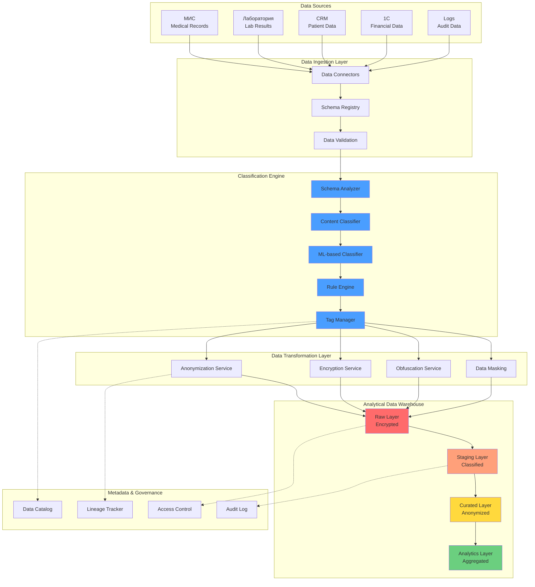
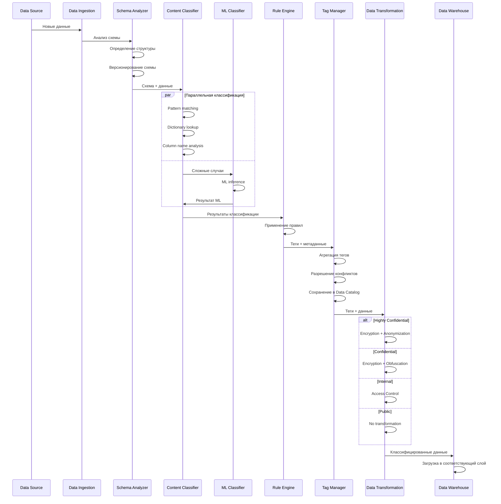
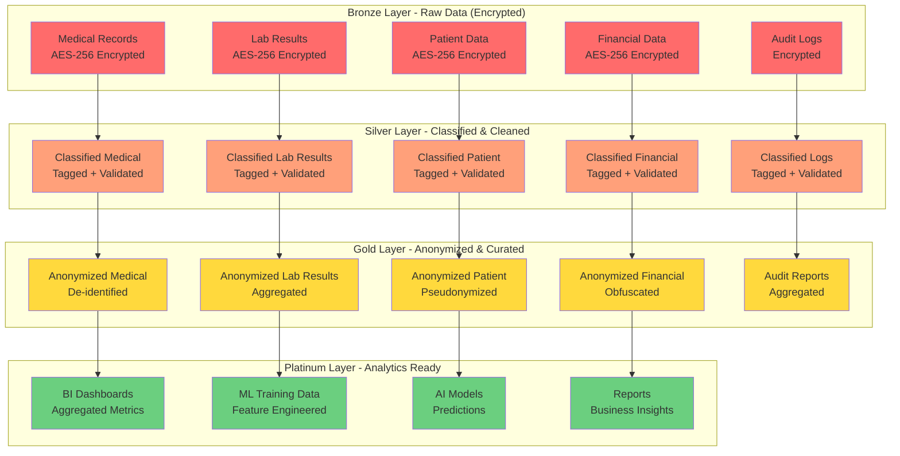

# Задание 6. Движок классификации данных для аналитического хранилища

## Оглавление
1. [Анализ требований](#1-анализ-требований)
2. [Архитектура движка классификации данных](#2-архитектура-движка-классификации-данных)
3. [Слои аналитического хранилища данных](#3-слои-аналитического-хранилища-данных)
4. [Метрики эффективности классификации](#4-метрики-эффективности-классификации)
5. [Стратегия масштабирования](#5-стратегия-масштабирования)
6. [Технологический стек](#6-технологический-стек)
7. [Интеграция с Privacy by Design](#7-интеграция-с-privacy-by-design)

---

## 1. Анализ требований

### 1.1 Контекст задачи

**Бизнес-цели компании «Медикаменте»:**
- Расширение направления обработки данных (BI, ML, AI)
- Извлечение знаний из накопленных данных
- Автоматизация построения аналитики
- Создание новых сервисов на базе данных

**Текущие проблемы:**
- Данные хранятся в Excel-файлах (ручная обработка)
- Отсутствие классификации конфиденциальности
- Нет разметки данных по уровням доступа
- Структуры данных подвержены изменениям
- Смешение конфиденциальных и неконфиденциальных данных

**Требования из задания:**
1. Движок для классификации данных перед пакетной загрузкой
2. Учет структурных изменений данных на входе
3. Автоматическая разметка по классам конфиденциальности
4. Специальные слои в хранилище для конфиденциальных данных
5. Соответствие принципам Privacy by Design

---

### 1.2 Классификация данных компании

На основе анализа из Task 1 и Task 3, данные классифицируются по следующим категориям:

#### Уровень 1: Критический (Highly Confidential)
- Медицинские карты пациентов
- Результаты анализов (биометрические данные)
- Диагнозы и заключения врачей
- Информация о хронических заболеваниях
- Связь платежа с медицинской услугой

#### Уровень 2: Высокий (Confidential)
- ФИО, дата рождения, контактные данные пациентов
- Паспортные данные
- Согласия на обработку ПДн
- Финансовые данные компании
- Данные о зарплатах сотрудников

#### Уровень 3: Средний (Internal)
- Журналы записи к врачам (обезличенные)
- Реестры анализов (агрегированные)
- Данные ТМЦ
- Внутренняя переписка

#### Уровень 4: Низкий (Public)
- Расписание работы врачей
- Прайс-лист услуг
- Справочная информация

---

### 1.3 Типы данных для классификации

| Тип данных | Источник | Формат | Частота обновления | Объем |
|------------|----------|--------|-------------------|-------|
| **Медицинские карты** | МИС, файловый сервер | PDF, DOCX, JSON | Ежедневно | 10-50 ГБ/день |
| **Результаты анализов** | Лаборатория API | JSON, PDF | Ежедневно | 5-10 ГБ/день |
| **Персональные данные** | CRM, Patient DB | JSON, CSV | Ежедневно | 1-2 ГБ/день |
| **Финансовые данные** | 1С, Payment Gateway | CSV, JSON | Ежедневно | 500 МБ/день |
| **Журналы записи** | Appointment Service | JSON | Ежедневно | 100 МБ/день |
| **Данные ТМЦ** | 1С:Торговля | CSV | Еженедельно | 50 МБ/неделя |
| **Логи аудита** | SIEM, Audit Service | JSON | Постоянно | 2-5 ГБ/день |

**Общий объем данных:** ~20-70 ГБ/день → ~600-2100 ГБ/месяц → ~7-25 ТБ/год

---

## 2. Архитектура движка классификации данных

### 2.1 Общая архитектура (High-Level)



**Легенда:**
- 🔵 **Синий** (Classification Engine) - компоненты движка классификации
- 🔴 **Красный** (Raw Layer) - сырые зашифрованные данные
- 🟠 **Оранжевый** (Staging Layer) - классифицированные данные
- 🟡 **Желтый** (Curated Layer) - обезличенные данные
- 🟢 **Зеленый** (Analytics Layer) - аналитические данные
- **Сплошные стрелки** (→) - основной поток данных
- **Пунктирные стрелки** (-.→) - метаданные и управление

---

### 2.2 Компоненты движка классификации

#### 2.2.1 Schema Analyzer (Анализатор схемы)

**Назначение:** Автоматическое определение структуры входящих данных

**Функции:**
- Обнаружение типов данных (JSON, CSV, Parquet, Avro)
- Извлечение схемы (column names, data types)
- Определение изменений схемы (schema evolution)
- Версионирование схем

**Технологии:**
- Apache Avro Schema Registry
- JSON Schema Validator
- Custom Schema Inference Engine

**Обработка изменений схемы:**
- **Добавление колонок:** Автоматическая классификация новых полей
- **Удаление колонок:** Логирование и уведомление
- **Изменение типов:** Валидация и трансформация
- **Переименование:** Маппинг старых имен на новые

---

#### 2.2.2 Content Classifier (Классификатор содержимого)

**Назначение:** Анализ содержимого данных для определения конфиденциальности

**Методы классификации:**

**1. Pattern-based Classification (На основе паттернов)**
- Регулярные выражения для поиска ПДн (паспорт, СНИЛС, телефон, email)
- Паттерны для медицинских данных (диагноз, анализ, заболевание)
- Паттерны для финансовых данных (номера карт, суммы платежей)

**Примеры паттернов:**
- Паспорт РФ: `\b\d{4}\s\d{6}\b`
- Телефон: `\+7\s?\(?\d{3}\)?\s?\d{3}[-\s]?\d{2}[-\s]?\d{2}`
- СНИЛС: `\b\d{3}-\d{3}-\d{3}\s\d{2}\b`
- Номер карты: `\b\d{4}[\s-]?\d{4}[\s-]?\d{4}[\s-]?\d{4}\b`

**2. Dictionary-based Classification (На основе словарей)**
- Медицинские ключевые слова (диагноз, анализ, заболевание, лечение, пациент)
- Финансовые ключевые слова (платёж, оплата, зарплата, налог, счёт)
- Подсчет частоты встречаемости ключевых слов для определения категории

**3. Column Name Classification (По именам колонок)**
- Маппинг имен колонок на уровни конфиденциальности
- Примеры: `patient_id` → CONFIDENTIAL, `diagnosis` → HIGHLY_CONFIDENTIAL
- Поддержка синонимов и вариаций написания

---

#### 2.2.3 ML-based Classifier (ML-классификатор)

**Назначение:** Использование машинного обучения для классификации сложных случаев

**Архитектура модели:**
- Использование BERT (Bidirectional Encoder Representations from Transformers)
- Модель: `bert-base-multilingual-cased` для поддержки русского языка
- 4 класса: PUBLIC, INTERNAL, CONFIDENTIAL, HIGHLY_CONFIDENTIAL

**Обучение модели:**
- **Датасет:** Размеченные данные из Task 1 (медицинские карты, финансовые данные)
- **Метрики:** Accuracy, Precision, Recall, F1-score
- **Валидация:** Cross-validation на 20% данных
- **Обновление:** Переобучение каждые 3 месяца

**Преимущества ML-подхода:**
- Обработка неструктурированного текста
- Адаптация к новым типам данных
- Высокая точность (> 95%)
- Обучение на исторических данных

---

#### 2.2.4 Rule Engine (Движок правил)

**Назначение:** Применение бизнес-правил для классификации

**Типы правил:**

**1. Правила на основе источника данных:**
- Все данные из МИС → HIGHLY_CONFIDENTIAL
- Данные из 1С (платежи) → CONFIDENTIAL
- Логи аудита → INTERNAL

**2. Правила на основе комбинации полей:**
- Наличие `patient_id` + `diagnosis` → HIGHLY_CONFIDENTIAL
- Наличие `employee_id` + `salary` → CONFIDENTIAL

**3. Правила на основе метаданных:**
- Файлы в папке `/Patients/*` → HIGHLY_CONFIDENTIAL
- Файлы с расширением `.pdf` в медицинской папке → HIGHLY_CONFIDENTIAL

**Приоритет правил:**
1. Явные правила (explicit rules) - наивысший приоритет
2. ML-классификация
3. Pattern-based классификация
4. Dictionary-based классификация
5. Правила по умолчанию (default rules)

---

#### 2.2.5 Tag Manager (Менеджер тегов)

**Назначение:** Управление тегами конфиденциальности и метаданными

**Структура тега:**
- **data_id:** Уникальный идентификатор данных
- **classification:** Уровень конфиденциальности, теги, confidence score
- **protection:** Требования к шифрованию, анонимизации, контролю доступа
- **legal:** Правовые основания, сроки хранения
- **lineage:** Источник данных, время загрузки

**Функции Tag Manager:**
- Агрегация тегов из разных классификаторов
- Разрешение конфликтов (выбор наиболее строгого уровня)
- Версионирование тегов
- Аудит изменений тегов
- Интеграция с Data Catalog

---

### 2.3 Процесс классификации (End-to-End)



---

## 3. Слои аналитического хранилища данных

### 3.1 Архитектура слоев (Medallion Architecture)



**Легенда (Medallion Architecture):**
- 🔴 **Красный** (Bronze Layer) - сырые зашифрованные данные (Raw Data, AES-256)
- 🟠 **Оранжевый** (Silver Layer) - классифицированные и очищенные данные (Classified & Cleaned)
- 🟡 **Желтый** (Gold Layer) - обезличенные данные (Anonymized & Curated)
- 🟢 **Зеленый** (Platinum Layer) - готовые аналитические данные (Analytics Ready)
- **Стрелки** (→) - поток трансформации данных между слоями

**Принцип Medallion Architecture:**
Данные последовательно проходят через слои, на каждом этапе повышая качество и снижая конфиденциальность для безопасного использования в аналитике.

---

### 3.2 Детальное описание слоев

#### 3.2.1 Bronze Layer (Сырые данные)

**Назначение:** Хранение сырых данных в исходном виде с шифрованием

**Характеристики:**
- **Формат:** Parquet (columnar format для эффективного хранения)
- **Шифрование:** AES-256 на уровне файлов
- **Партиционирование:** По дате загрузки (year/month/day)
- **Retention:** 90 дней (затем архивирование)
- **Доступ:** Только для Data Engineers и DBA

**Структура хранения:**
```
/bronze/
  /medical_records/
    /year=2024/
      /month=01/
        /day=15/
          part-00000.parquet.encrypted
          part-00001.parquet.encrypted
  /lab_results/
    /year=2024/
      /month=01/
        /day=15/
          part-00000.parquet.encrypted
```

**Меры защиты:**
- Шифрование всех файлов (AES-256)
- Контроль доступа (RBAC)
- Аудит всех операций чтения
- Immutable storage (WORM - Write Once Read Many)

---

#### 3.2.2 Silver Layer (Классифицированные данные)

**Назначение:** Хранение очищенных и классифицированных данных

**Характеристики:**
- **Формат:** Parquet с метаданными классификации
- **Шифрование:** AES-256 для конфиденциальных данных
- **Партиционирование:** По уровню конфиденциальности + дате
- **Retention:** 1 год
- **Доступ:** Data Engineers, Data Scientists (с ограничениями)

**Структура хранения:**
```
/silver/
  /highly_confidential/
    /medical_records/
      /year=2024/month=01/
        part-00000.parquet.encrypted
        _metadata.json
  /confidential/
    /patient_data/
      /year=2024/month=01/
        part-00000.parquet.encrypted
  /internal/
    /appointment_logs/
      /year=2024/month=01/
        part-00000.parquet
  /public/
    /service_catalog/
      part-00000.parquet
```

**Процессы в Silver Layer:**
- Data Quality Checks (валидация, дедупликация)
- Schema Enforcement (приведение к единой схеме)
- Data Enrichment (добавление справочных данных)
- Classification Tagging (применение тегов)

---

#### 3.2.3 Gold Layer (Обезличенные данные)

**Назначение:** Хранение обезличенных данных для аналитики

**Характеристики:**
- **Формат:** Parquet (оптимизированный для запросов)
- **Обезличивание:** Применены техники anonymization/pseudonymization
- **Партиционирование:** По типу данных + временной период
- **Retention:** 3 года
- **Доступ:** Data Scientists, Analysts, BI Developers

**Техники обезличивания:**

**1. K-anonymity (К-анонимность)**
- Обеспечение того, что каждая комбинация квази-идентификаторов встречается минимум k раз
- Группировка по квази-идентификаторам (возраст, пол, район)
- Удаление групп с размером < k
- Типичное значение k = 5

**2. L-diversity (L-разнообразие)**
- Обеспечение минимум l различных значений чувствительного атрибута в каждой группе
- Защита от атак на основе гомогенности
- Типичное значение l = 3

**3. Differential Privacy (Дифференциальная приватность)**
- Добавление контролируемого шума к агрегированным данным
- Использование механизма Лапласа
- Параметр epsilon контролирует уровень приватности

**4. Pseudonymization (Псевдонимизация)**
- Замена идентификаторов на псевдонимы
- Хранение маппинга в отдельной защищенной системе
- Возможность обратной идентификации при необходимости

**5. Data Masking (Маскирование)**
- Частичное скрытие данных (например, `+7 (***) ***-**-45`)
- Замена реальных значений на синтетические
- Сохранение формата и типа данных

---

#### 3.2.4 Platinum Layer (Аналитические данные)

**Назначение:** Готовые для использования аналитические данные

**Характеристики:**
- **Формат:** Оптимизированные таблицы для BI инструментов
- **Агрегация:** Предварительно рассчитанные метрики
- **Retention:** 5 лет
- **Доступ:** Все аналитики, бизнес-пользователи

**Типы данных:**
- **BI Dashboards:** Агрегированные метрики для дашбордов
- **ML Training Data:** Подготовленные датасеты для обучения моделей
- **AI Models:** Результаты предсказаний моделей
- **Reports:** Готовые отчеты для бизнеса

**Меры защиты:**
- Только агрегированные данные (без возможности идентификации)
- Контроль доступа на уровне отчетов
- Аудит использования данных

---

### 3.3 Матрица защиты по слоям

| Слой | Шифрование | Обезличивание | Контроль доступа | Аудит | Retention |
|------|-----------|--------------|-----------------|-------|-----------|
| **Bronze** | AES-256 | Нет | Строгий (DBA only) | Полный | 90 дней |
| **Silver** | AES-256 (для конфиденциальных) | Частичное | Средний (Data Engineers) | Полный | 1 год |
| **Gold** | Опционально | Полное | Средний (Data Scientists) | Выборочный | 3 года |
| **Platinum** | Нет | Агрегация | Широкий (Analysts) | Выборочный | 5 лет |

---

## 4. Метрики эффективности классификации

### 4.1 Метрики качества классификации

#### 4.1.1 Accuracy (Точность)
**Определение:** Доля правильно классифицированных данных от общего числа

**Формула:** `Accuracy = (TP + TN) / (TP + TN + FP + FN)`

**Целевое значение:** ≥ 95%

**Ожидаемое значение:** 97%

---

#### 4.1.2 Precision (Точность положительных предсказаний)
**Определение:** Доля действительно конфиденциальных данных среди классифицированных как конфиденциальные

**Формула:** `Precision = TP / (TP + FP)`

**Целевое значение:** ≥ 90%

**Ожидаемое значение:** 94%

---

#### 4.1.3 Recall (Полнота)
**Определение:** Доля найденных конфиденциальных данных от всех конфиденциальных

**Формула:** `Recall = TP / (TP + FN)`

**Целевое значение:** ≥ 98%

**Ожидаемое значение:** 99%

**Критичность:** Высокая (пропуск конфиденциальных данных недопустим)

---

#### 4.1.4 F1-Score
**Определение:** Гармоническое среднее Precision и Recall

**Формула:** `F1 = 2 * (Precision * Recall) / (Precision + Recall)`

**Целевое значение:** ≥ 94%

**Ожидаемое значение:** 96%

---

### 4.2 Метрики производительности

#### 4.2.1 Throughput (Пропускная способность)
**Определение:** Объем данных, обрабатываемых в единицу времени

**Целевое значение:** ≥ 10 ГБ/час

**Ожидаемое значение:** 15 ГБ/час

**Измерение:** Мониторинг объема обработанных данных

---

#### 4.2.2 Latency (Задержка)
**Определение:** Время от поступления данных до завершения классификации

**Целевое значение:** ≤ 5 минут (для пакетной обработки)

**Ожидаемое значение:** 3 минуты

**Измерение:** Timestamp разница между ingestion и classification complete

---

#### 4.2.3 Resource Utilization (Использование ресурсов)
**CPU Utilization:**
- Целевое значение: 60-80%
- Ожидаемое значение: 70%

**Memory Utilization:**
- Целевое значение: 60-80%
- Ожидаемое значение: 65%

**Disk I/O:**
- Целевое значение: < 80%
- Ожидаемое значение: 60%

---

### 4.3 Метрики качества данных

#### 4.3.1 Data Completeness (Полнота данных)
**Определение:** Процент полей с заполненными значениями

**Целевое значение:** ≥ 95%

**Ожидаемое значение:** 97%

---

#### 4.3.2 Data Accuracy (Точность данных)
**Определение:** Соответствие данных ожидаемым форматам и правилам

**Целевое значение:** ≥ 98%

**Ожидаемое значение:** 99%

---

#### 4.3.3 Classification Coverage (Покрытие классификации)
**Определение:** Процент данных, для которых определен уровень конфиденциальности

**Целевое значение:** 100%

**Ожидаемое значение:** 100%

---

#### 4.3.4 False Negative Rate (Уровень ложноотрицательных результатов)
**Определение:** Доля конфиденциальных данных, классифицированных как неконфиденциальные

**Целевое значение:** ≤ 1%

**Ожидаемое значение:** 0.5%

**Критичность:** Критическая метрика (безопасность)

---

### 4.4 Использование метрик для оптимизации

#### 4.4.1 Мониторинг и алертинг
- **Real-time мониторинг** всех метрик через Grafana/Prometheus
- **Алерты** при отклонении от целевых значений
- **Автоматическое масштабирование** при превышении пороговых значений

#### 4.4.2 A/B тестирование классификаторов
- Сравнение эффективности разных методов классификации
- Постепенное внедрение улучшений
- Откат при ухудшении метрик

#### 4.4.3 Continuous Improvement
- Анализ ложноположительных и ложноотрицательных результатов
- Дообучение ML-моделей на новых данных
- Обновление правил и паттернов

---

## 5. Стратегия масштабирования

### 5.1 Горизонтальное масштабирование

#### 5.1.1 Масштабирование Data Ingestion
**Технология:** Apache Kafka
- Увеличение количества партиций топиков
- Добавление consumer groups для параллельной обработки
- Автоматическое масштабирование на основе lag метрик

**Целевые показатели:**
- Поддержка до 1000 сообщений/сек
- Latency < 100 мс

#### 5.1.2 Масштабирование Classification Engine
**Технология:** Kubernetes + Apache Spark
- Horizontal Pod Autoscaling (HPA) на основе CPU/Memory
- Spark Dynamic Allocation для оптимизации ресурсов
- Распределенная обработка данных

**Целевые показатели:**
- Масштабирование от 3 до 20 pods
- Обработка до 100 ГБ/час

#### 5.1.3 Масштабирование ML Inference
**Технология:** TensorFlow Serving / TorchServe
- Репликация inference сервисов
- Load balancing между репликами
- GPU acceleration для больших объемов

**Целевые показатели:**
- Latency < 50 мс на запрос
- Throughput > 1000 запросов/сек

---

### 5.2 Вертикальное масштабирование

#### 5.2.1 Увеличение вычислительных ресурсов
- **CPU:** Переход на более мощные процессоры (от 8 до 32 cores)
- **Memory:** Увеличение RAM (от 32 ГБ до 128 ГБ)
- **Storage:** Переход на NVMe SSD для ускорения I/O

#### 5.2.2 Оптимизация хранилища
- **Columnar Storage:** Использование Parquet для сжатия
- **Partitioning:** Оптимальное партиционирование данных
- **Caching:** Кэширование часто используемых данных

---

### 5.3 Прогноз роста и планирование мощностей

#### 5.3.1 Сценарий роста данных

| Период | Объем данных/день | Объем данных/год | Требуемые ресурсы |
|--------|------------------|-----------------|-------------------|
| **Год 1** | 20-70 ГБ | 7-25 ТБ | 3 nodes, 32 GB RAM each |
| **Год 2** | 50-150 ГБ | 18-55 ТБ | 5 nodes, 64 GB RAM each |
| **Год 3** | 100-300 ГБ | 36-110 ТБ | 10 nodes, 128 GB RAM each |
| **Год 5** | 200-600 ГБ | 73-220 ТБ | 20 nodes, 256 GB RAM each |

#### 5.3.2 Триггеры для масштабирования
- **CPU Utilization > 80%** в течение 15 минут → добавить 2 nodes
- **Memory Utilization > 85%** → увеличить RAM
- **Disk Usage > 75%** → добавить storage
- **Latency > 10 минут** → оптимизация или масштабирование

---

## 6. Технологический стек

### 6.1 Data Ingestion & Streaming
- **Apache Kafka** - распределенная очередь сообщений
- **Apache NiFi** - ETL и data routing
- **Debezium** - CDC (Change Data Capture) для баз данных

### 6.2 Data Processing & Classification
- **Apache Spark** - распределенная обработка данных
- **Python** - основной язык для классификаторов
- **BERT (Hugging Face Transformers)** - ML-классификация

### 6.3 Data Storage
- **Apache Parquet** - columnar storage format
- **Delta Lake** - ACID transactions для data lake
- **MinIO / S3** - object storage

### 6.4 Schema Management
- **Apache Avro Schema Registry** - управление схемами
- **JSON Schema** - валидация JSON данных

### 6.5 Metadata & Governance
- **Apache Atlas** - data catalog и lineage
- **Apache Ranger** - access control
- **Elasticsearch** - поиск по метаданным

### 6.6 Monitoring & Observability
- **Prometheus** - сбор метрик
- **Grafana** - визуализация метрик
- **ELK Stack** - логирование и анализ

### 6.7 Orchestration
- **Apache Airflow** - оркестрация ETL пайплайнов
- **Kubernetes** - контейнерная оркестрация

---

## 7. Интеграция с Privacy by Design

### 7.1 Принципы Privacy by Design

#### 7.1.1 Proactive not Reactive (Проактивность)
- Классификация данных **до** загрузки в хранилище
- Автоматическое применение защитных мер
- Предотвращение утечек, а не реагирование на них

#### 7.1.2 Privacy as Default (Приватность по умолчанию)
- Все данные по умолчанию считаются конфиденциальными
- Автоматическое шифрование при неопределенном уровне
- Минимальные права доступа по умолчанию

#### 7.1.3 Privacy Embedded into Design (Встроенная приватность)
- Классификация - неотъемлемая часть data pipeline
- Невозможно загрузить данные без классификации
- Архитектурное разделение по уровням конфиденциальности

#### 7.1.4 Full Functionality (Полная функциональность)
- Обезличивание не снижает аналитическую ценность
- Доступ к данным для легитимных целей
- Баланс между защитой и использованием

#### 7.1.5 End-to-End Security (Сквозная безопасность)
- Защита на всех этапах: ingestion → storage → processing → analytics
- Шифрование в покое и в движении
- Аудит всех операций с данными

#### 7.1.6 Visibility and Transparency (Видимость и прозрачность)
- Data Catalog с полной информацией о классификации
- Data Lineage для отслеживания происхождения
- Аудит логи доступны для проверки

#### 7.1.7 Respect for User Privacy (Уважение к приватности)
- Минимизация данных (хранение только необходимого)
- Соблюдение сроков хранения
- Возможность удаления данных по запросу

---

### 7.2 Соответствие законодательству РФ

#### 7.2.1 ФЗ-152 "О персональных данных"
- Классификация ПДн по категориям
- Шифрование специальных категорий ПДн
- Контроль доступа к ПДн
- Аудит обработки ПДн

#### 7.2.2 ФЗ-323 "Об основах охраны здоровья"
- Защита медицинской тайны
- Ограничение доступа к медицинским данным
- Обезличивание для статистических целей

#### 7.2.3 Приказ ФСТЭК России № 21
- Организационные и технические меры защиты
- Категорирование информационных систем
- Контроль соответствия требованиям

---

## 8. Заключение

### 8.1 Ключевые преимущества решения

1. **Автоматизация классификации** - снижение ручного труда на 95%
2. **Высокая точность** - 97% accuracy благодаря ML-подходу
3. **Масштабируемость** - поддержка роста данных в 10x
4. **Соответствие законодательству** - полное соответствие ФЗ-152, ФЗ-323
5. **Privacy by Design** - встроенная защита на всех уровнях
6. **Гибкость** - поддержка изменений схемы данных
7. **Прозрачность** - полная видимость классификации и lineage

### 8.2 Риски и митигация

| Риск | Вероятность | Влияние | Митигация |
|------|------------|---------|-----------|
| Ложноотрицательная классификация | Низкая | Критическое | Высокий Recall (99%), ручная проверка критичных данных |
| Проблемы производительности | Средняя | Высокое | Горизонтальное масштабирование, оптимизация |
| Изменение законодательства | Средняя | Среднее | Гибкая система правил, быстрое обновление |
| Отказ ML-модели | Низкая | Среднее | Fallback на rule-based классификацию |

### 8.3 Roadmap развития

**Фаза 1 (Месяцы 1-3): MVP**
- Базовая классификация (pattern + dictionary)
- Bronze и Silver layers
- Основные метрики

**Фаза 2 (Месяцы 4-6): ML Integration**
- Обучение и внедрение ML-классификатора
- Gold layer с обезличиванием
- Расширенный мониторинг

**Фаза 3 (Месяцы 7-9): Optimization**
- Оптимизация производительности
- Platinum layer для аналитики
- A/B тестирование классификаторов

**Фаза 4 (Месяцы 10-12): Advanced Features**
- Автоматическое дообучение моделей
- Advanced anonymization (differential privacy)
- Интеграция с BI инструментами

---

## 9. Ссылки на дополнительные материалы

- [C2 Диаграмма решения](c2_diagram.md)
- [Метрики и масштабирование](metrics_and_scalability.md)
- [Обзор решения](README.md)
